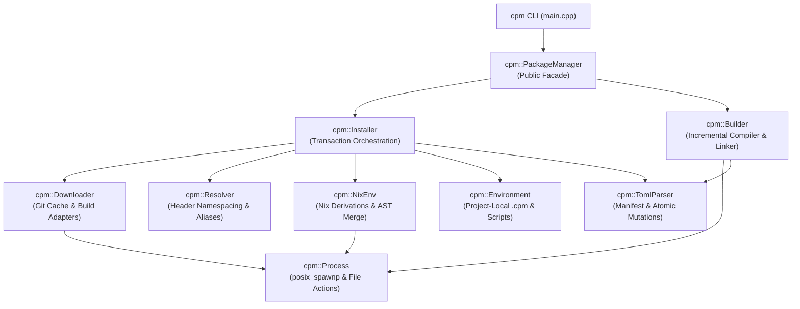
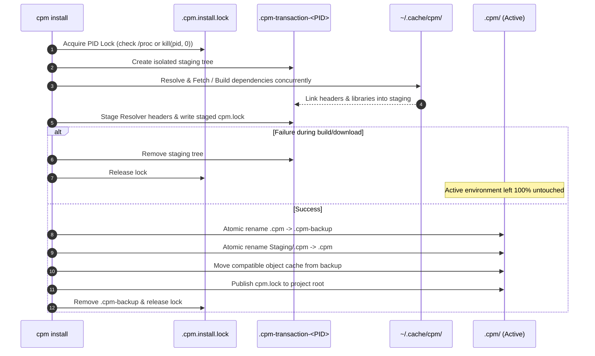
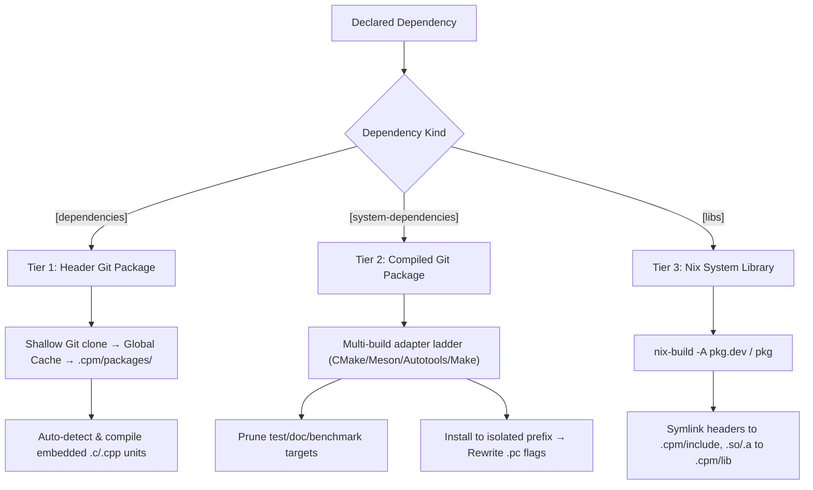
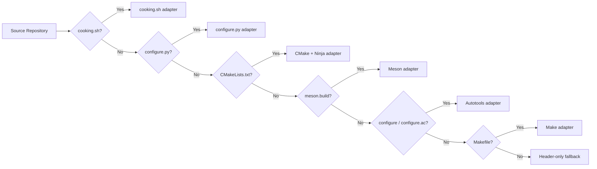
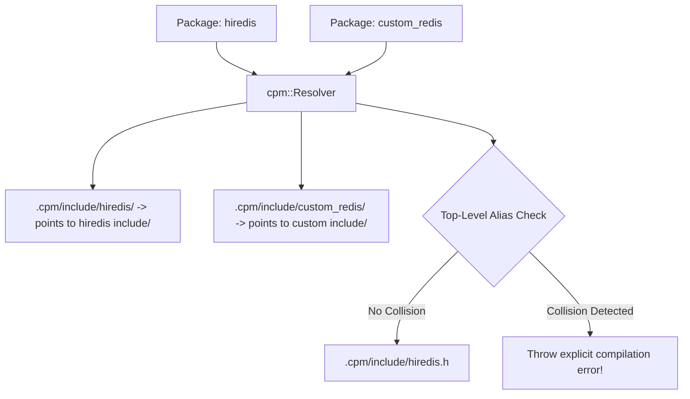
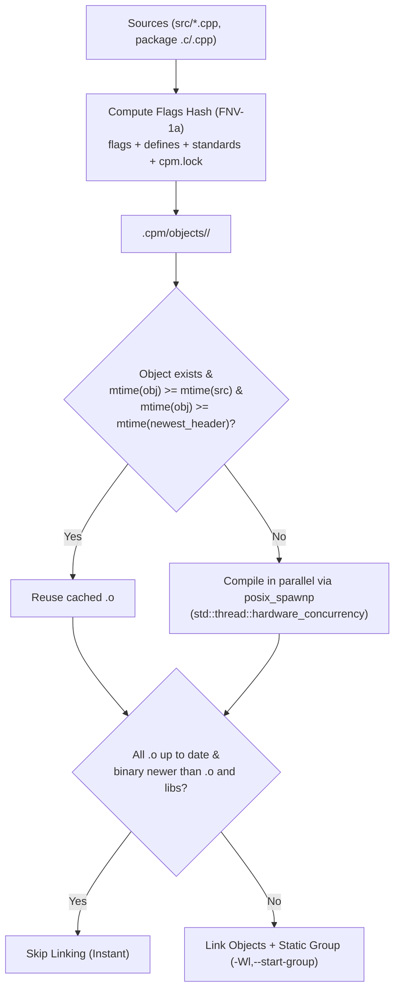
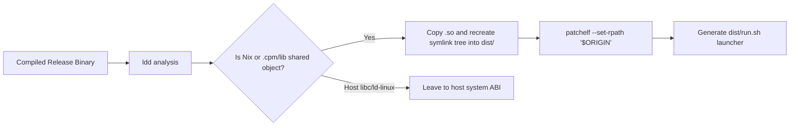

Dependency management in C and C++ has spent decades in fragmentation. While modern languages like Rust and Go enjoy first-class package managers (`cargo` and `go`), C/C++ developers are traditionally forced to choose between several painful extremes:

1. **Linux distribution package managers (`apt`, `pacman`, `dnf`, `zypper`)**: Require `sudo`, mutate host `/usr` or `/usr/local`, create environment drift between developer machines and CI, and make it impossible for two projects on the same machine to use different library versions.
2. **Heavyweight package ecosystems (`vcpkg`, `Conan`)**: Rely on complex Python runtimes, monolithic centralized recipe registries, multi-gigabyte checkouts, and invasive CMake toolchain files (`CMAKE_TOOLCHAIN_FILE`) that dictate how projects must be configured.
3. **CMake configure-time fetchers (`FetchContent`, `CPM.cmake`)**: Force dependency resolution and builds directly into CMake's configuration phase, causing configure times to skyrocket by 10x–50x, polluting CMake target namespaces with naming collisions, and failing completely whenever a dependency uses Meson, Autotools, or Make.
4. **Pure Nix**: Offers complete hermeticity and reproducibility, but introduces a steep learning curve with its domain-specific language, requires packaging non-Nix repositories manually, and lacks the project-local, zero-friction CLI developer experience expected in modern workflows.

**CPM** is built from scratch in C++20 to solve these problems. It is a lightweight, project-local C and C++ package and environment manager designed specifically for Linux. It resolves Git dependencies, builds compiled libraries across standard build systems, seamlessly acquires system libraries through Nix, and isolates all generated headers, libraries, tools, and build metadata inside `.cpm/`.

This article explores the real internals of `cpm_core`—not an abstract design, but the exact algorithms, locking mechanisms, build adapters, and memory models running in the codebase.

The CPM architecture is built around six core design guarantees:

- **Transactional Staging** — Install operations run inside `.cpm-transaction-<pid>` and publish atomically; failed builds leave the active environment completely untouched.
- **Universal Build Adaptation** — Automated multi-build ladder supporting CMake, Meson, Autotools, Make, `configure.py`, and `cooking.sh` with aggressive feature pruning.
- **Hermetic System Libraries** — Non-root system library acquisition via Nix with automatic C/C++ AST header and `find_package()` scanning.
- **Namespaced Header Isolation** — Prevention of header shadowing through isolated package namespaces (`.cpm/include/<pkg>/...`) and export collision detection.
- **Parallel Incremental Engine** — High-speed parallel compilation with FNV-1a flags-hashed object caching and static archive linker groups (`-Wl,--start-group`).
- **Portable Distribution** — Self-contained release bundles with automatic `ldd` shared library resolution and `$ORIGIN` RPATH patching.

---

## 1. System Architecture Overview

`cpm_core` is architected as a modular static library where each component has a strictly delimited responsibility. The `cpm` CLI executable acts as a thin dispatch layer delegating directly to `cpm::PackageManager`.



### Component Responsibilities

- **`PackageManager`**: The high-level facade exposing initialization, dependency queries, build triggers, and compile-commands generation for Language Server Protocols (LSP / Clangd).
- **`Installer`**: Coordinates install transactions, acquires process locks, manages staging directories, orchestrates parallel downloads and builds, and executes atomic directory publication.
- **`Downloader`**: Handles shallow Git clones, resolves version tags, derives FNV-1a cache keys, and dispatches the multi-build-system adapter ladder.
- **`Resolver`**: Solves header collision by generating both namespaced views (`.cpm/include/<package>/...`) and non-conflicting compatibility symlinks.
- **`NixEnv`**: Bridges the host to Nixpkgs. Automatically derives build toolchains and library attributes by scanning C/C++ source ASTs and CMake configurations.
- **`Builder`**: Handles parallel incremental compilation, object hashing, linker group resolution, and release bundle generation.
- **`Process`**: Safe process execution engine using `posix_spawnp` with explicit file descriptor actions—guaranteeing zero shell interpolation.
- **`Environment`**: Manages the project-local `.cpm/` filesystem tree and produces the idempotent, reversible `activate.sh` script.

---

## 2. Transactional Staging & Atomic Publication

One of the most dangerous failure modes of traditional package managers is **partial installation corruption**: a build fails at 90%, leaving the project with half-copied headers, broken shared libraries, and an unusable environment.

CPM eliminates this with a **transactional staging model**:



### Atomic Process Locking

To prevent multiple instances of `cpm install` from clobbering each other, CPM uses atomic directory creation paired with process liveness detection via `kill(owner, 0)`:

```cpp
void acquire_install_lock(const fs::path &lock) {
    if (!fs::create_directory(lock)) {
        std::ifstream owner_file(lock / "pid");
        pid_t owner = 0;
        owner_file >> owner;
        
        // Check if the process holding the lock is still alive
        if (owner > 0 && (::kill(owner, 0) == 0 || errno == EPERM)) {
            throw std::runtime_error("another cpm install is already running in this project (pid " + 
                                     std::to_string(owner) + ")");
        }
        
        // Reclaim stale lock from a dead process
        std::error_code error;
        fs::remove_all(lock, error);
        if (error || !fs::create_directory(lock)) {
            throw std::runtime_error("cannot reclaim stale install lock: " + lock.string());
        }
    }
    std::ofstream owner_file(lock / "pid", std::ios::trunc);
    owner_file << ::getpid() << '\n';
}
```

### RAII Transaction Rollback

The entire installation lifecycle is wrapped in an RAII `Cleanup` guard. If any C++ exception is thrown during tag resolution, Git cloning, source compilation, or Nix linking, the staging folder is wiped and the active `.cpm/` remains undisturbed:

```cpp
struct Cleanup {
    fs::path lock;
    fs::path staging;
    ~Cleanup() {
        std::error_code error;
        if (!staging.empty()) fs::remove_all(staging, error);
        fs::remove_all(lock, error);
    }
} cleanup{.lock = lock, .staging = project_root_ / (".cpm-transaction-" + std::to_string(::getpid()))};
```

---

## 3. The Multi-Tiered Dependency Model

CPM recognizes that dependencies in C and C++ cannot be treated uniformly. Some are header-only libraries, some are heavy C/C++ Git repositories with custom build systems, and others are pre-compiled system libraries that should come from a verified package repository.

CPM cleanly divides dependencies into three tiers inside `cpm.toml`:

```toml
[project]
name = "service"
version = "0.2.0"
cpp_standard = "20"
compiler = "gcc-13"
nixpkgs = "nixos-24.05"

[dependencies]
# Tier 1: Header-only Git packages
json = "github:nlohmann/json@v3.11.3"

[system-dependencies]
# Tier 2: Compiled Git packages (built from source)
hiredis = "github:redis/hiredis@v1.2.0"

[libs]
# Tier 3: Nix-resolved system packages
ssl = "openssl"
zlib = "zlib"
```



---

### Tier 1: Header-Only Packages & Automatic Source Detection

Header-only libraries are cloned into the global content cache and linked into `.cpm/packages/<alias>`.

A frequent annoyance in C/C++ is that many "header-like" libraries (such as `cJSON`, `sqlite3`, or `stb`) include single C or C++ implementation translation units. Normally, users are forced to change their build system scripts to manually compile these files. 

CPM automates this in `Builder::collect_source_files()`: it recursively scans `.cpm/packages/` for implementation units (`.c`, `.cpp`), automatically excludes test, benchmark, and fuzz files, and includes them directly in the application build:

```cpp
// Header dependencies may ship implementation units (e.g. cJSON.c).
// Compile those package sources into the application automatically.
const auto packages = local_cpm_dir_ / "packages";
if (fs::is_directory(packages)) {
    for (const auto &package : fs::directory_iterator(packages)) {
        if (!package.is_directory() && !package.is_symlink()) continue;
        for (const auto &entry : fs::recursive_directory_iterator(package.path())) {
            if (!entry.is_regular_file() || !package_build_source(entry.path())) continue;
            if (cpp_source_extension(entry.path()) || c_source_extension(entry.path())) {
                sources.insert(fs::weakly_canonical(entry.path()).string());
            }
        }
    }
}
```

---

### Tier 2: Universal Build System Adapter Ladder

For packages under `[system-dependencies]`, CPM does not require the upstream repository to be rewritten to fit CPM. Instead, `Downloader::build_from_source()` evaluates an automated build adapter priority ladder:



#### Intelligent Feature Pruning

When building third-party dependencies with CMake, up to 80% of the build time is often wasted compiling unit tests, documentation, sample applications, and benchmarks.

CPM parses the root `CMakeLists.txt` with regex and dynamically generates `-D<FEATURE>=OFF` flags for all non-essential targets:

```cpp
std::vector<std::string> disabled_cmake_features(const fs::path &path) {
    std::ifstream input(path);
    const std::string contents((std::istreambuf_iterator<char>(input)), {});
    static const std::regex option(R"(option\s*\(\s*([A-Za-z0-9_]+))", std::regex::icase);
    static constexpr std::array<std::string_view, 10> disabled = {
        "_APP", "_APPS", "_BENCHMARK", "_BENCHMARKS", 
        "_DEMO", "_DEMOS", "_DOC", "_DOCS", "_TEST", "_TESTING"
    };
    
    std::vector<std::string> arguments;
    for (std::sregex_iterator match(contents.begin(), contents.end(), option), end; match != end; ++match) {
        const auto name = (*match)[1].str();
        std::string upper = name;
        std::ranges::transform(upper, upper.begin(), [](unsigned char c) { 
            return static_cast<char>(std::toupper(c)); 
        });
        if (std::ranges::any_of(disabled, [&](const auto suffix) { return upper.ends_with(suffix); })) {
            arguments.emplace_back("-D" + name + "=OFF");
        }
    }
    return arguments;
}
```

#### Post-Stage pkg-config Prefix Rewriting

When a library builds into a temporary staging path (e.g. `/tmp/.cpm-build-xyz`), its generated `.pc` files bake that temporary path into `prefix=/tmp/...`.

After publishing the built artifacts to the permanent global cache, CPM scans all `.pc` files in `lib/pkgconfig` and dynamically rewrites `prefix=` to the new canonical location:

```cpp
void rewrite_pkgconfig_prefix(const fs::path &built, const std::string &old_prefix) {
    const auto new_prefix = built.string();
    if (old_prefix == new_prefix) return;
    for (const auto &pc_root : {built / "lib" / "pkgconfig", built / "lib64" / "pkgconfig", built / "share" / "pkgconfig"}) {
        if (!fs::is_directory(pc_root)) continue;
        for (const auto &entry : fs::directory_iterator(pc_root)) {
            if (entry.path().extension() != ".pc") continue;
            // String replacement of old temporary prefix with permanent cache prefix
            // ...
        }
    }
}
```

---

### Tier 3: Declarative Nix Integration & Source-Level Auto-Detection

CPM leverages Nix as an isolated provider for system packages and versioned compilers without requiring the user to become a Nix expert.

#### Source & CMake AST Inspection

When resolving dependencies for a package, `NixEnv::detect_nix_deps()` inspects the source tree in two passes:
1. **Build Tooling Detection**: Identifies required tools like `cmake`, `ninja`, `meson`, `python3`, `autoconf`, `automake`, `libtool`, `pkg-config`.
2. **Include & `find_package` Regex Scanning**: Detects system includes (such as `<liburing.h>`, `<xfs/xfs.h>`, `<dpdk/...>`) and CMake `find_package()` invocations, automatically mapping them to Nixpkgs attributes.

```cpp
static const std::map<std::string, std::string> include_prefix_to_nix = {
    {"xfs/", "xfsprogs"},
    {"liburing", "liburing"},
    {"dpdk/", "dpdk"},
    {"numa", "numactl"},
    {"libaio", "libaio"},
    {"sctp", "lksctp-tools"},
};
```

#### Non-Destructive User `shell.nix` Merging

If the user provides a custom `shell.nix` via `nix_config = "./shell.nix"`, CPM does not overwrite or ignore it. Instead, it parses the `with pkgs; [ ... ]` block, computes the set difference of missing dependencies, and produces a wrapped derivation using Nix's `overrideAttrs`:

```nix
# Generated by CPM — user nix_config merged with CPM dependencies
{ pkgs ? import <nixpkgs> {} }:
let
  userShell = import /path/to/project/shell.nix { inherit pkgs; };
  cpmExtra  = with pkgs; [ pkg-config openssl liburing ];
in userShell.overrideAttrs (old: {
  packages = (old.packages or []) ++ cpmExtra;
})
```

---

## 4. Namespaced Header Resolution (`cpm::Resolver`)

The classic C/C++ header problem is **shadowing**: if two dependencies (e.g., `liba` and `libb`) both expose a file named `include/utils.h` or `config.h`, a conventional flat `-I` include search path will arbitrarily pick whichever directory comes first in the compiler command line. This causes subtle compilation errors or silent runtime undefined behavior.

CPM's `Resolver` creates two distinct layers in `.cpm/include/`:

1. **Namespaced Package Views**: Every package gets an isolated symlink under `.cpm/include/<package_name>/`. A project can unambiguously write:
   ```cpp
   #include <json/json.hpp>
   #include <hiredis/hiredis.h>
   ```
2. **Non-Conflicting Compatibility Aliases**: For standard single-header or library includes, compatibility aliases are symlinked directly into `.cpm/include/`.
3. **Collision Detection**: If two compiled packages export identical file names to the top-level include directory, CPM aborts with an explicit `header export collision` error rather than allowing silent overwrites.



---

## 5. Parallel Incremental Build Engine (`cpm::Builder`)

CPM includes its own high-speed build engine tailored for modern multi-core machines.



### Compiler Flag Environment Hashing

Objects are organized under `.cpm/objects/<flags-hash>/<source-stem>-<source-hash>.o`. 

The flags hash uses an FNV-1a hash algorithm computed over:
- The full list of compilation flags (`-O3`, `-Wall`, `-std=c++20`, `-D...`)
- The active standard library and defines
- The complete contents of `cpm.lock` (so altering a dependency immediately invalidates dependent object files)

```cpp
uint64_t fnv1a(const std::vector<std::string> &values) {
    uint64_t hash = 1469598103934665603ULL;
    for (const auto &value : values) {
        for (const unsigned char c : value) {
            hash ^= c;
            hash *= 1099511628211ULL;
        }
        hash ^= 0xff;
        hash *= 1099511628211ULL;
    }
    return hash;
}
```

### Static Linker Grouping

In Unix linkers (`ld.bfd`, `ld.gold`, `lld`), static libraries (`.a`) are scanned linearly from left to right. If library `libA.a` calls a symbol in `libB.a` and `libB.a` calls back into `libA.a` (cyclic reference) or if they are specified in the wrong order, linking fails with unresolved external symbol errors.

CPM prevents this by automatically grouping all `.cpm/lib/*.a` archives inside linker groups:

```cpp
if (!archives.empty()) args.emplace_back("-Wl,--start-group");
for (const auto &archive : archives) args.emplace_back(archive.string());
if (!archives.empty()) args.emplace_back("-Wl,--end-group");
```

---

## 6. Zero-Shell Execution via `posix_spawnp`

Traditional build scripts frequently construct strings and pass them to `/bin/sh -c` or `system()`. This approach is slow (forking shell interpreters) and vulnerable to shell injection or parsing errors when paths contain spaces, quotes, or special characters (`$`, `;`, `&`).

CPM executes all compilers and tools directly via `posix_spawnp`, with precise control over file descriptor redirection via `posix_spawn_file_actions_t`:

```cpp
ProcessResult Process::run(
    const std::vector<std::string> &arguments, 
    const fs::path &working_directory, 
    const std::map<std::string, std::string> &environment, 
    bool capture_output
) {
    std::vector<char *> argv;
    for (const auto &arg : arguments) argv.push_back(const_cast<char *>(arg.c_str()));
    argv.push_back(nullptr);

    auto environment_storage = merged_environment(environment);
    std::vector<char *> envp;
    for (auto &entry : environment_storage) envp.push_back(entry.data());
    envp.push_back(nullptr);

    posix_spawn_file_actions_t actions;
    posix_spawn_file_actions_init(&actions);

    if (!working_directory.empty()) {
        posix_spawn_file_actions_addchdir_np(&actions, working_directory.c_str());
    }

    // Set up pipes for stdout/stderr capture without running /bin/sh
    // ...
    
    pid_t pid = -1;
    int error = posix_spawnp(&pid, argv.front(), &actions, nullptr, argv.data(), envp.data());
    posix_spawn_file_actions_destroy(&actions);
    
    // Read pipe buffers and waitpid(pid, &status, 0)
    // ...
}
```

---

## 7. Portable Production Bundling (`cpm build --release`)

Creating portable Linux distribution binaries for C/C++ applications with dynamic dependencies is notoriously difficult due to `glibc` versions and shared library paths (`LD_LIBRARY_PATH` vs `RPATH`).

When running `cpm build --release`, CPM:
1. Applies profile optimizations (`-O3` or `-Oz`, `-flto`, dead-code section elimination `-ffunction-sections -fdata-sections -Wl,--gc-sections`, and symbol stripping `-s`).
2. Runs `ldd` against the final binary and filters out host base glibc libraries (`libc.so`, `ld-linux.so`).
3. Copies all Nix-managed and CPM-managed shared `.so` libraries into `dist/`.
4. Executes `patchelf --set-rpath '$ORIGIN'` to instruct the Linux dynamic linker to look in the binary's local directory first.
5. Emits a self-contained POSIX `run.sh` launcher script.



---

## 8. Architectural Comparison: Why CPM is Better

To understand the difference CPM makes in developer velocity and reliability, consider how it compares across major C/C++ packaging strategies:

| Dimension | CMake `FetchContent` / `CPM.cmake` | `vcpkg` / `Conan` | Linux Distro PMs (`apt`/`pacman`/`dnf`) | **CPM (Linux)** |
| :--- | :--- | :--- | :--- | :--- |
| **Runtime & Dependencies** | Requires CMake | Python / CMake / Git clones | System package manager + `sudo` | **Zero dependencies** (Pure C++20 static binary) |
| **Isolation Boundary** | None (Pollutes CMake targets & global scope) | Global or toolchain-specific | None (Pollutes `/usr` or `/usr/local`) | **Strict project-local** (`.cpm/`) |
| **Build Configuration Overhead** | Re-evaluates during CMake configure step (10x–50x slowdown) | Multi-stage toolchain files & manifest downloads | Fast install, but zero isolation | **Instant** (Incremental flags cache & prebuilt staging) |
| **Supported Upstream Build Systems** | CMake only | Custom recipes / CMake wrappers | Prebuilt OS binaries only | **Universal** (CMake, Meson, Autotools, Make, configure.py, Nix) |
| **System Library Management** | None (User must install on host) | Complex ports / build recipes | Host-level mutation only | **Declarative Nix integration** (Hermetic, non-root) |
| **Failure Safety** | Partial builds corrupt configure state | Incomplete cache entries | Leaves broken `/usr` state | **Atomic transactions** (Staging + backup rollback) |
| **Header Shadowing Protection** | None (Flat `-I` list) | Partial | None | **Namespaced views + export collision detection** |
| **IDE / LSP Support** | Requires full CMake configure | Requires toolchain integration | Manual configuration | **Automatic `compile_commands.json`** |

---

## 9. Summary

C and C++ do not suffer from a lack of compilers or build systems; they suffer from the lack of a **hermetic, non-intrusive orchestration layer**.

By combining:
- **Transactional filesystem staging** with atomic publication and rollback,
- A **multi-build-system adapter ladder** that prunes unnecessary test/doc targets,
- **Declarative Nix integration** for non-root, repeatable system library acquisition,
- **Namespaced header resolution** to eliminate include shadowing, and
- A **parallel incremental compiler engine** keyed on compiler flag hashes and `posix_spawnp` execution,

CPM proves that C/C++ package management can achieve the same clean, project-local ergonomics and speed as modern toolchains like Cargo, without sacrificing native performance or backwards compatibility.
