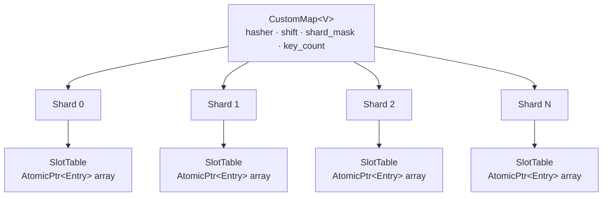
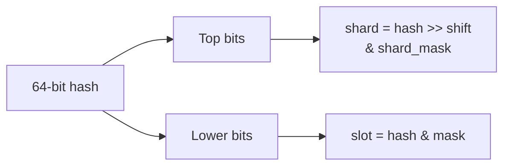
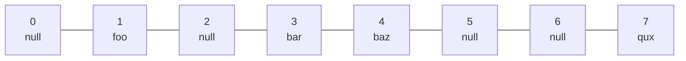
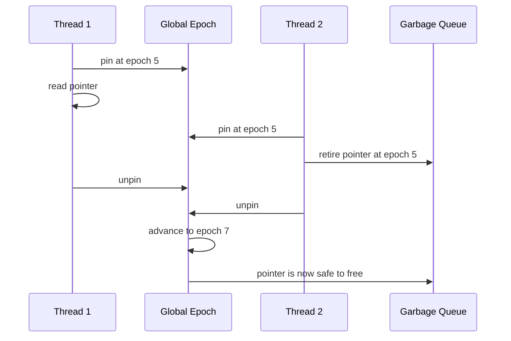
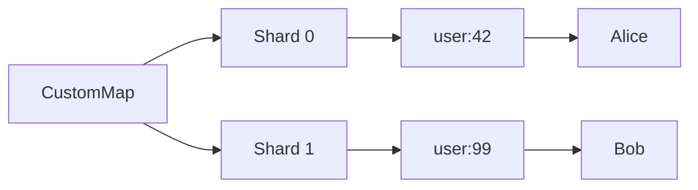
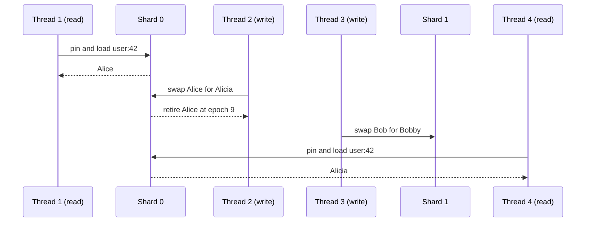
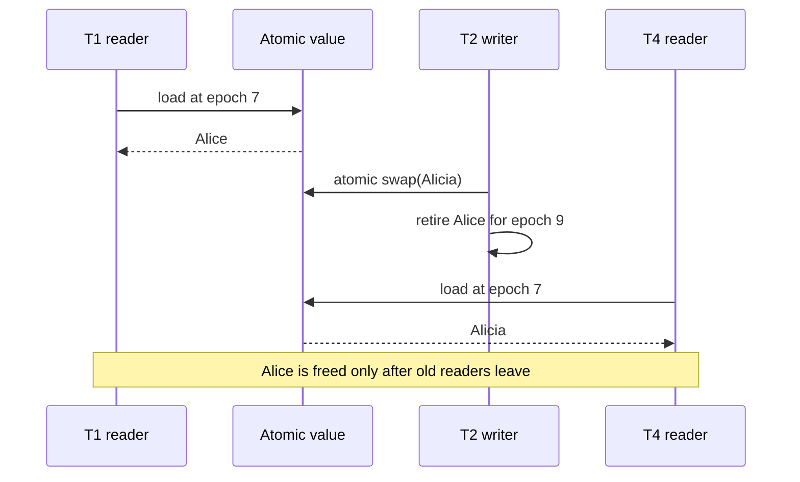
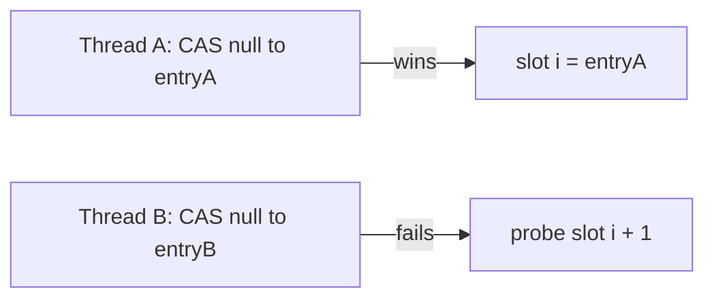

# Building a Lock-Free Concurrent HashMap in Rust from Scratch

Most concurrent hash maps in the wild use a single `RwLock` or a per-bucket `Mutex`. They're fine — until they're not. Under high contention, lock acquisition becomes a bottleneck that kills throughput. This post walks through building `CustomMap`: a **sharded, lock-free concurrent HashMap** in Rust that multiple threads can read and write *simultaneously* without ever blocking each other on reads.

## Architecture Overview

The design splits into three independent layers:



The three layers:

1. **`CustomMap`** — the public facade. Computes the hash, routes to the right shard.
2. **`Shard`** — owns one `SlotTable`. Has a `grow_lock` only used during resize (not reads).
3. **`SlotTable`** — a flat array of `AtomicPtr<Entry<V>>`. Open-addressing with linear probing. Completely lock-free for reads and writes.

---

## Layer 1 — Routing: How a Key Finds Its Shard

```rust
#[inline(always)]
fn locate(&self, key: &str) -> (u64, usize) {
    let h = self.hasher.hash_one(key);
    (h, ((h >> self.shift) as usize) & self.shard_mask)
}
```

The **top bits** of the hash select the shard, and the **lower bits** are used for slot indexing inside that shard. This spreads load evenly across all shards.



Using `foldhash::fast::RandomState` gives us randomised hashing — preventing hash-flooding attacks.

---

## Layer 2 — The SlotTable: Lock-Free Open Addressing

Each `Shard` holds a `SlotTable`: a boxed slice of `AtomicPtr<Entry<V>>`. Slots default to `null`.



**Linear Probing** — if slot `i` is taken, try `i+1`, `i+2`, etc. (modulo capacity).

### Reading — Zero Locks

```rust
fn find(&self, key: &str, hash: u64) -> Option<&Entry<V>> {
    let t = self.table();
    let mut i = (hash as usize) & t.mask;
    loop {
        let p = unsafe { t.slots.get_unchecked(i) }.load(Ordering::Acquire);
        if p.is_null() {
            return None;              // empty slot = key not here
        }
        let e = unsafe { &*p };
        if e.hash == hash && e.key == key {
            return Some(e);           // found it
        }
        i = (i + 1) & t.mask;        // probe next
    }
}
```

`Acquire` load ensures we see all writes to the entry that happened before the `Release` store that put the pointer there. **No mutex, no lock, no spin on a lock word.**

---

## Layer 3 — EBR: Safe Memory Reclamation Without GC

Here's the hard problem: Thread A reads a value pointer. Thread B removes the key and `free()`s the memory. Thread A now has a dangling pointer. 💥

The solution is **Epoch-Based Reclamation (EBR)**, implemented in `ebr.rs`.

### How Epochs Work



Every thread registers a `Participant` with its own `local` epoch:

```rust
struct Participant {
    local: CachePadded<AtomicU64>,  // current epoch while active, 0 = inactive
    next: *mut Participant,          // intrusive linked list
}
```

When a thread wants to read safely, it **pins** — snapping its local epoch to the global one:

```rust
fn pin(&mut self) {
    if self.depth == 1 {
        loop {
            let e = GLOBAL_EPOCH.load(Relaxed);
            participant.local.store(e, Release);
            fence(Acquire);
            if GLOBAL_EPOCH.load(Acquire) == e { break; }
            participant.local.store(INACTIVE, Release);
        }
    }
}
```

When it unpins, it stores `INACTIVE`. The collector only advances the global epoch if **every active thread** is on the current epoch — proving no one holds an old pointer.

---

## Multi-Thread Access: What Actually Happens

Let's trace four threads hitting the map simultaneously.





Key insight: **Threads 1 and 2 both access shard[0], but neither blocks the other.** Thread 1's read is atomic — it either sees the old value or the new one, never a torn write. Thread 2's `swap` is a single CAS on the `AtomicPtr` — no lock needed.



---

## The `insert` Path with CAS Loop

When inserting a *new* key, we need to atomically claim a slot. The CAS loop:

```rust
if slot.compare_exchange(
    ptr::null_mut(),   // expected: slot is empty
    entry,             // desired: our new entry
    Ordering::Release,
    Ordering::Acquire,
).is_ok() {
    return true;  // we won the race
}
// Another thread grabbed this slot first — probe next
```

Two threads racing to insert different keys at the same slot:



No lost inserts. No corruption. Pure atomics.

---

## Resizing — The One Lock

Growing the table is the *only* place we use a mutex, and only to serialise concurrent resize attempts — readers are never blocked:

```rust
fn grow(&self) {
    let _lock = self.grow_lock.lock();

    // re-check: maybe another thread already grew while we waited
    if self.len.load(Relaxed) < old_table.threshold { return; }

    // allocate new table, rehash all entries into it
    // entries are raw pointers — no cloning, no allocation per entry
    self.table.store(new_ptr, Ordering::Release);  // atomic swap
}
```

Readers loading `self.table` with `Acquire` will immediately see the new table pointer after this store. Old table memory leaks briefly until the EBR collector reclaims it (not yet implemented — but the slot pointers remain valid since entries are never freed during resize, only the table shell changes).

---

## Performance Characteristics

| Operation | Contention | Cost |
|-----------|------------|------|
| `get`     | Zero (lock-free read) | O(1) amortised |
| `insert` (existing key) | Per-entry CAS | O(1) amortised |
| `insert` (new key) | Per-slot CAS + len CAS | O(1) amortised |
| `remove`  | Per-entry swap + EBR retire | O(1) amortised |
| `grow`    | Shard mutex (writers only) | O(n/shards) |

With 16 shards (default), growing is isolated to 1/16th of the keyspace at a time.

---

## Putting It All Together: A Real Example

```rust
use std::sync::Arc;
use std::thread;

fn main() {
    // 16 shards, 10_000 expected keys
    let map = Arc::new(CustomMap::<u64>::with_capacity(16, 10_000));

    let mut handles = vec![];

    // 8 writer threads
    for t in 0..8u64 {
        let m = Arc::clone(&map);
        handles.push(thread::spawn(move || {
            for i in 0..1000u64 {
                m.insert(format!("thread:{t}:key:{i}"), t * 1000 + i);
            }
        }));
    }

    // 4 reader threads
    for _ in 0..4 {
        let m = Arc::clone(&map);
        handles.push(thread::spawn(move || {
            for t in 0..8u64 {
                for i in 0..1000u64 {
                    // may return None if writer hasn't inserted yet — that's fine
                    let _ = m.get(&format!("thread:{t}:key:{i}"));
                }
            }
        }));
    }

    for h in handles { h.join().unwrap(); }

    println!("Total keys: {}", map.len()); // 8000
}
```

All 12 threads run concurrently. No `Mutex`, no `RwLock` on the hot path. The EBR layer ensures that readers never observe freed memory, even when writers are actively removing keys.

---

## What's Next

- **Tombstone-free deletion** — currently removes by nulling the value pointer, leaving "ghost" entries in the probe chain. True tombstone-free deletion requires a full resize.
- **Iteration safety** — `for_each` pins EBR but doesn't snapshot, so insertions during iteration may or may not be visible.
- **SIMD probing** — scanning 16 slots at once with SSE2 (à la Swiss Table / Hashbrown).
- **Value pool recycling** — the EBR allocator already pools `ValueBox` allocations per type; could extend with a slab allocator.

The [full source is on GitHub](https://github.com/Rana718/FlashDB/tree/main/crates/customhash) if you want to dig deeper.
