Most concurrent hash maps begin with a sensible design: put an `RwLock` around a normal map, or divide the table into buckets protected by smaller locks. That approach is easy to reason about and is often fast enough. It becomes less attractive when a read-heavy workload needs predictable latency while many threads update unrelated keys.

This article studies the real `customhash` crate used in the project—not a simplified textbook map. It combines **sharding**, **open addressing**, **atomic pointer publication**, **compare-and-swap updates**, and **epoch-based reclamation (EBR)**. Reads avoid mutexes. Normal inserts and updates coordinate through atomics. Resizing is deliberately different: writers serialize table growth with one mutex per shard.

> “Lock-free” does not mean that every operation completes in a fixed number of steps. It means system-wide progress continues even if one participating thread pauses. This implementation also contains stronger read paths, but resizing and cloning values still have real costs.

## What We Are Building

`CustomMap<V>` is a concurrent `String -> V` map where `V: Clone + Send + Sync + 'static`. Its public surface supports cloned reads, guarded borrowed reads, conditional insertion, CAS-loop updates, logical deletion, iteration, retention, and explicit capacity inspection.

The design optimizes for these properties:

- reads do not acquire a mutex;
- unrelated shards update independently;
- an existing value can be replaced with one atomic pointer swap;
- removed values are reclaimed only after old readers are gone;
- shard metadata is cache-line separated to reduce false sharing;
- the table stays below a 70% load factor to keep probe chains short.

It does **not** promise snapshot iteration, immediate physical deletion, or wait-free writes. The updated implementation now safely reclaims old table shells after resize through EBR.

## Architecture Overview

The design splits into three independent layers:

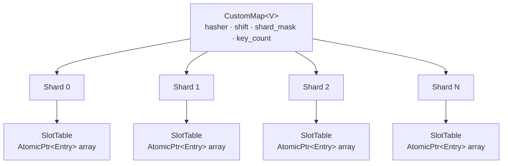

The three layers:

1. **`CustomMap`** — the public facade. Computes the hash, routes to the right shard.
2. **`Shard`** — owns one `SlotTable`. Has a `grow_lock` only used during resize (not reads).
3. **`SlotTable`** — a flat array of `AtomicPtr<Entry<V>>`. It uses open addressing and linear probing. Reads and ordinary updates use atomics; shard growth is serialized.

### The Actual Memory Layout

The map stores entries and values separately. A slot points to a stable `Entry<V>`, while the entry contains another atomic pointer to the replaceable value:

```rust
struct Entry<V> {
    hash: u64,
    value: AtomicPtr<ValueBox<V>>,
    key: String,
}

struct SlotTable<V> {
    slots: Box<[AtomicPtr<Entry<V>>]>,
    mask: usize,
    threshold: usize,
}

#[repr(align(128))]
struct Shard<V> {
    table: AtomicPtr<SlotTable<V>>,
    len: CachePadded<AtomicUsize>,
    insert_gate: CachePadded<AtomicUsize>,
    grow_lock: Mutex<()>,
}
```

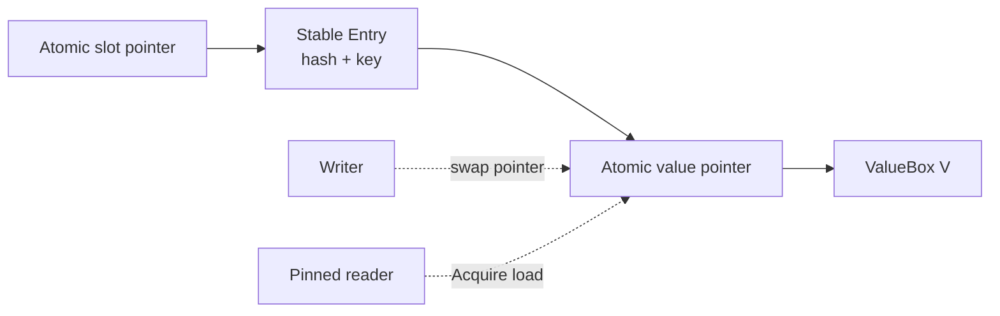

This extra indirection is intentional. Updating a value does not move the key, hash, or table slot. The writer allocates a new `ValueBox`, swaps one pointer, and retires the old box. That keeps the probing structure stable for concurrent readers.

The `#[repr(align(128))]` shard alignment and cache-padded length/gate counters reduce false sharing. Threads modifying shard 0's insertion state should not constantly invalidate the cache line containing shard 1's hot metadata.

### Capacity Is Always a Power of Two

`SlotTable::new` rounds capacity upward and stores `mask = capacity - 1`. That turns modulo operations into a cheap bitwise AND:

```rust
let cap = cap.next_power_of_two().max(8);
let mask = cap - 1;
let threshold = cap * 7 / 10;
```

At a capacity of 1,024, growth begins at 716 live reservations. The empty space is not waste: it bounds average probe length and guarantees that a lookup can eventually encounter a null slot.

---

## Layer 1 — Routing: How a Key Finds Its Shard

```rust
#[inline(always)]
fn locate(&self, key: &str) -> (u64, usize) {
    let h = self.hasher.hash_one(key);
    (h, ((h >> self.shift) as usize) & self.shard_mask)
}
```

The **top bits** of the hash select the shard, and the **lower bits** are used for slot indexing inside that shard. This spreads load evenly across all shards.

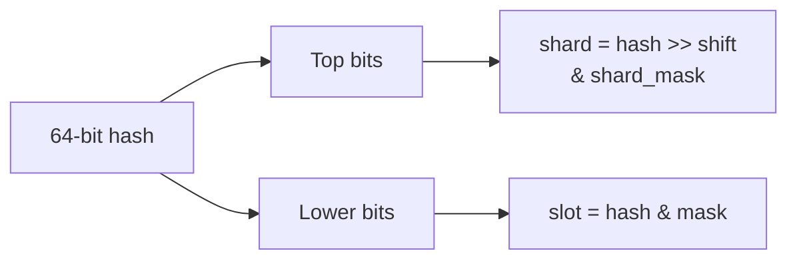

Using `foldhash::fast::RandomState` gives us randomised hashing — preventing hash-flooding attacks.

---

## Layer 2 — The SlotTable: Lock-Free Open Addressing

Each `Shard` holds a `SlotTable`: a boxed slice of `AtomicPtr<Entry<V>>`. Slots default to `null`.

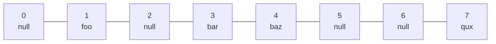

**Linear Probing** — if slot `i` is taken, try `i+1`, `i+2`, etc. (modulo capacity).

### Reading — Zero Locks

```rust
fn find(&self, key: &str, hash: u64) -> Option<&Entry<V>> {
    let t = self.table();
    let mut i = (hash as usize) & t.mask;
    loop {
        let p = unsafe { t.slots.get_unchecked(i) }.load(Ordering::Acquire);
        if p.is_null() {
            return None;              // empty slot = key not here
        }
        let e = unsafe { &*p };
        if e.hash == hash && e.key == key {
            return Some(e);           // found it
        }
        i = (i + 1) & t.mask;        // probe next
    }
}
```

`Acquire` load ensures we see all writes to the entry that happened before the `Release` store that put the pointer there. The updated read APIs pin **before loading and traversing the table**, so an old table generation cannot be reclaimed while a reader is still probing it. Reads take no mutex and never enter the insertion gate.

### Three Read APIs, Three Ownership Trade-offs

The crate exposes more than `get`:

| API               | Returned data     | Pin lifetime               | Best use                                     |
| ----------------- | ----------------- | -------------------------- | -------------------------------------------- |
| `get(key)`        | cloned `V`        | only during the clone      | simple ownership and short critical sections |
| `get_ref(key)`    | `ValueRef<'_, V>` | until the guard is dropped | avoid cloning a large value                  |
| `with_entry(...)` | closure result    | while the closure runs     | precomputed hash/shard and controlled access |

`get_ref` ties the borrowed pointer to an EBR guard:

```rust
pub struct ValueRef<'a, V> {
    ptr: *const ValueBox<V>,
    _guard: ebr::Guard,
    _map: PhantomData<&'a CustomMap<V>>,
}
```

The guard is not decoration. Its `Drop` implementation unpins the thread. As long as the `ValueRef` exists, reclamation cannot recycle the pointed-to value. Holding it for a long time is safe, but it can delay reclamation for every retired value waiting on that epoch.

---

## Layer 3 — EBR: Safe Memory Reclamation Without GC

Here's the hard problem: Thread A reads a value pointer. Thread B removes the key and `free()`s the memory. Thread A now has a dangling pointer. 💥

The solution is **Epoch-Based Reclamation (EBR)**, implemented in `ebr.rs`.

### How Epochs Work

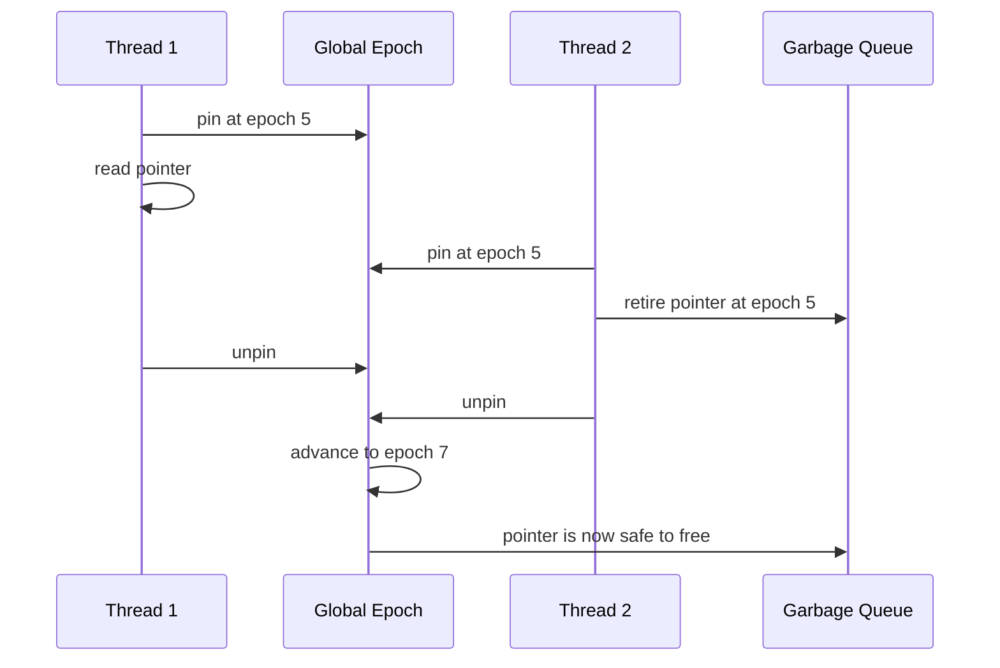

Every thread registers a `Participant` with its own `local` epoch:

```rust
struct Participant {
    local: CachePadded<AtomicU64>,  // current epoch while active, 0 = inactive
    next: *mut Participant,          // intrusive linked list
}
```

When a thread wants to read safely, it **pins** — snapping its local epoch to the global one:

```rust
fn pin(&mut self) {
    if self.depth == 1 {
        loop {
            let e = GLOBAL_EPOCH.load(Relaxed);
            participant.local.store(e, Release);
            fence(Acquire);
            if GLOBAL_EPOCH.load(Acquire) == e { break; }
            participant.local.store(INACTIVE, Release);
        }
    }
}
```

When it unpins, it stores `INACTIVE`. The collector only advances the global epoch if **every active thread** has caught up — proving no active participant is still protected by an older epoch.

### What the Collector Actually Stores

Retired values are not dropped immediately. Each thread has a thread-local `Local` record containing its participant pointer, nesting depth, retired garbage, and a small typed allocation pool:

```rust
struct Local {
    participant: *const Participant,
    garbage: Vec<Garbage>,
    depth: usize,
    retires: usize,
    pool: Vec<(*mut u8, unsafe fn(*mut u8), TypeId)>,
    collect_on_unpin: bool,
    initialized: bool,
}
```

Collection normally runs every 512 retirements. An item retired at epoch `e` becomes reclaimable when the observed safe epoch satisfies `e + 2 <= safe`. Reclaimable `ValueBox` allocations enter a per-thread pool with a limit of 1,024 entries. A later replacement of the same Rust type can reuse that allocation instead of calling the allocator again.

The new collector distinguishes **recyclable values** from **non-recyclable structural allocations**. Value boxes may enter the typed pool; retired `SlotTable` boxes must be destroyed. Retiring a table sets `collect_on_unpin`, causing collection attempts as soon as the outermost guard leaves instead of waiting for another 512 value retirements.

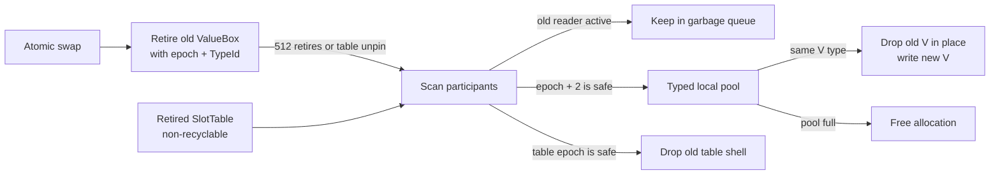

Nested reads are supported with `depth`. Only the outermost pin publishes an epoch, and only the final unpin marks the participant inactive. This avoids accidentally leaving a nested operation unprotected.

---

## Multi-Thread Access: What Actually Happens

Let's trace four threads hitting the map simultaneously.

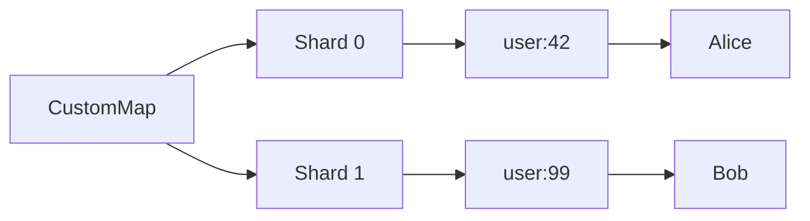

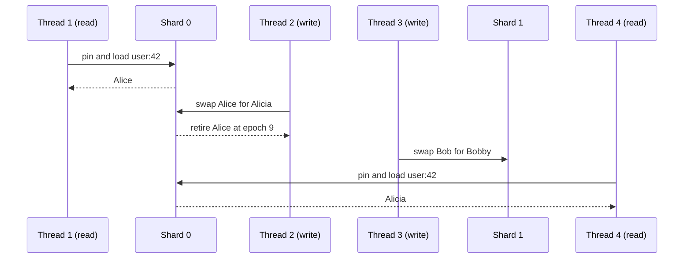

Key insight: **Threads 1 and 2 both access shard[0], but neither blocks the other.** Thread 1's read is atomic — it either sees the old value or the new one, never a torn write. Thread 2 replaces the value with one atomic `swap` on the `AtomicPtr` — no lock needed.

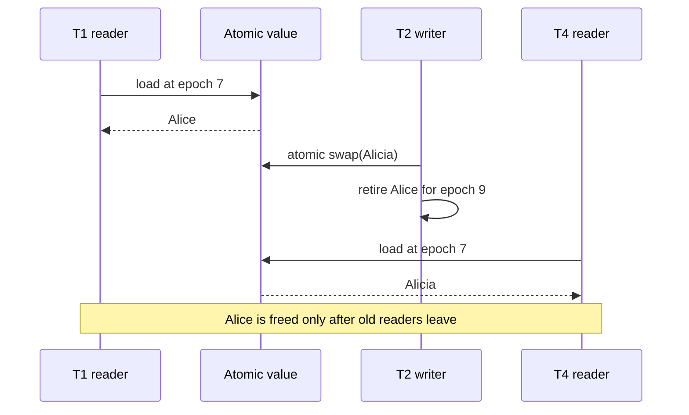

---

## The `insert` Path with CAS Loop

When inserting a _new_ key, we need to atomically claim a slot. The CAS loop:

```rust
if slot.compare_exchange(
    ptr::null_mut(),   // expected: slot is empty
    entry,             // desired: our new entry
    Ordering::Release,
    Ordering::Acquire,
).is_ok() {
    return true;  // we won the race
}
// Another thread grabbed this slot first — probe next
```

Two threads racing to insert different keys at the same slot:

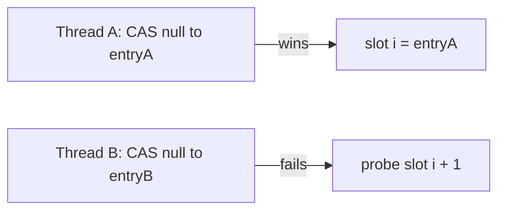

No lost inserts. No corruption. Pure atomics.

### Why Insertion Reserves Length Before Publishing

When an empty slot is found, the implementation first reserves capacity by incrementing the shard length with `compare_exchange_weak`. Only then does it publish the entry pointer into the slot. This prevents many racing writers from all passing the load-factor check and overfilling the table.

There is another race to handle: after allocating an entry, a writer may discover that another thread inserted the same key. In that case it swaps its freshly allocated value into the existing entry, releases any reserved length, frees the unused entry shell, and retires the replaced value.

The updated path allocates the `ValueBox` and `Entry` once before its retry loop rather than cloning both the key and value on every growth retry. The entry remains privately owned until the slot CAS publishes it.

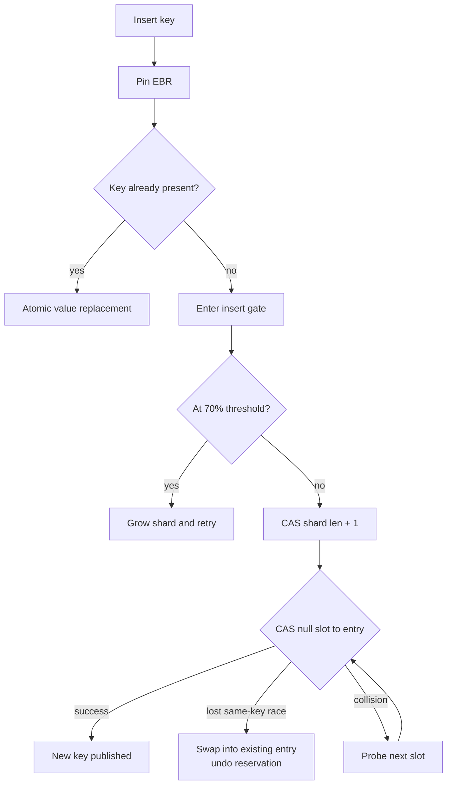

## Updating Without Lost Writes

`update` is a read-modify-write operation implemented as a CAS loop. The closure receives the currently observed value and produces a replacement plus a caller-defined result:

```rust
loop {
    let old_ptr = entry.value.load(Ordering::Acquire);
    if old_ptr.is_null() {
        return None;
    }

    let (new_val, result) = f(unsafe { &(*old_ptr).0 });
    let new_ptr = new_value(new_val);

    match entry.value.compare_exchange(
        old_ptr,
        new_ptr,
        Ordering::AcqRel,
        Ordering::Acquire,
    ) {
        Ok(_) => {
            unsafe { ebr::retire_value(old_ptr) };
            return Some(result);
        }
        Err(_) => unsafe { free_value(new_ptr) },
    }
}
```

If another writer wins first, the CAS fails, the speculative allocation is freed, and the closure runs again against the new current value. Because of that retry behavior, the closure must not perform irreversible side effects such as sending a payment, writing a file, or emitting a non-idempotent message.

`try_update` adds one more branch: the closure can return `None` to cancel the update after inspecting the value.

## Removal Is Logical, Not Structural

Deletion swaps the value pointer to null but leaves the `Entry` in its slot:

```rust
let old = entry.value.swap(ptr::null_mut(), Ordering::AcqRel);
if !old.is_null() {
    self.key_count.fetch_sub(1, Ordering::Relaxed);
    unsafe { ebr::retire_value(old) };
}
```

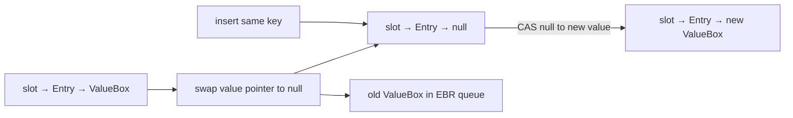

Keeping the entry shell is essential for the current probing algorithm. Turning the slot itself back into null could break a collision chain and cause lookups for later keys to stop too early. The same key can be resurrected by CAS-ing its null value pointer, but an unrelated key does not reuse that occupied entry slot until a growth rehash omits logically deleted entries.

---

## Resizing — The One Lock

Growing the table is the _only_ place a shard uses a mutex, and only to serialize competing growth attempts. Readers are never blocked. New-key insertion has one additional atomic coordination mechanism: an `insert_gate` whose high bit means `GROWING` and whose remaining bits count active inserters.

```rust
fn grow(&self) {
    let _lock = self.grow_lock.lock().unwrap_or_else(|e| e.into_inner());

    while self.insert_gate.compare_exchange_weak(
        0,
        GROWING,
        Ordering::AcqRel,
        Ordering::Relaxed,
    ).is_err() {
        std::hint::spin_loop();
    }

    self.grow_locked();
    self.insert_gate.store(0, Ordering::Release);
}
```

### Why the Insert Gate Was Added

Without a gate, an inserter could load the old table while a growing writer copies its slots, then publish a new entry into that old table after the copy has passed that slot. The new table would never receive the entry. The gate closes that race:

1. An inserter atomically increments the active-inserter count unless `GROWING` is set.
2. Its `InsertGuard` decrements the count on every return path through `Drop`.
3. A growing writer holds `grow_lock` and CAS-es the gate from exactly `0` to `GROWING`.
4. Reaching `GROWING` proves every old-table inserter has exited.
5. The writer copies live entries, publishes the new table, retires the old table, then reopens insertion.

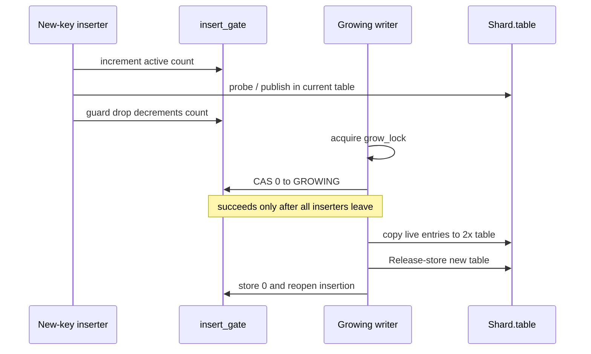

Existing-key updates still swap the value pointer in the stable entry and do not require this gate. The gate specifically protects structural publication of new entries during table migration.

### Old Tables Are Now Reclaimed

After copying live entries, growth publishes the new pointer and retires the old table through EBR:

```rust
let new_ptr = Box::into_raw(new_table);
self.table.store(new_ptr, Ordering::Release);
unsafe { ebr::retire_box(old_ptr) };
```

Every public operation that traverses table slots is pinned while it loads and uses the table pointer. Therefore the old `SlotTable` remains alive until all readers that could have observed it leave their critical sections. Unlike value boxes, table shells are marked non-recyclable and are dropped instead of entering the value allocation pool.

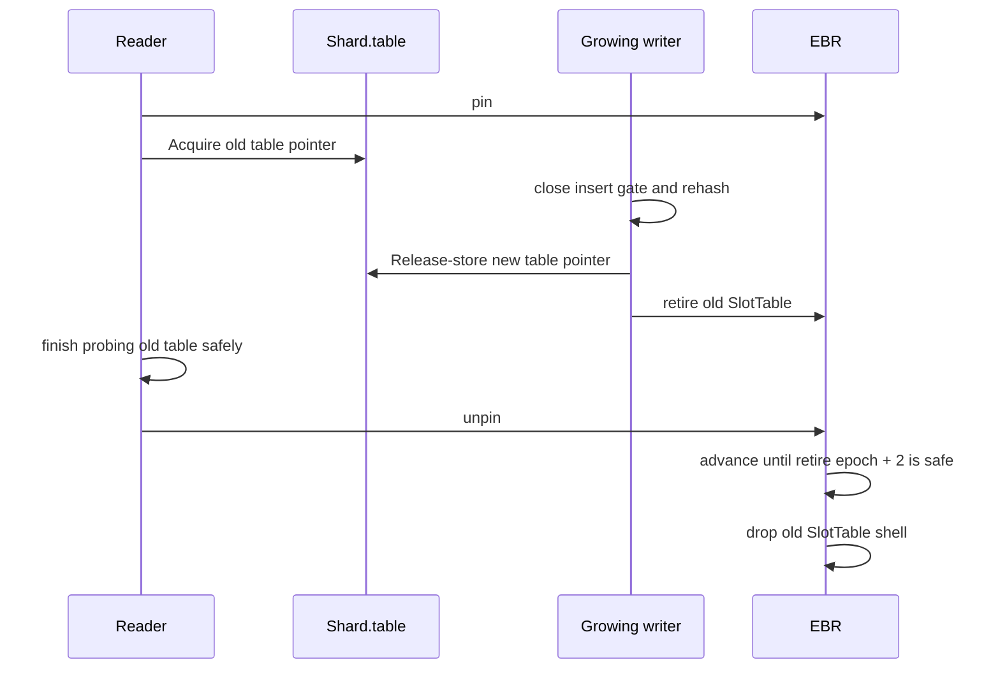

Readers never take `grow_lock` or touch `insert_gate`; the mutex prevents multiple writers from rebuilding the same shard, while the gate creates a clean migration boundary for new entries. A writer that waited for the lock rechecks the threshold because another writer may already have completed the growth.

## Atomic Ordering: Why Each One Is There

| Operation            | Ordering  | Reason                                                           |
| -------------------- | --------- | ---------------------------------------------------------------- |
| load shard table     | `Acquire` | observe the initialized table published by a writer              |
| load entry slot      | `Acquire` | observe the fully initialized key, hash, and value pointer       |
| publish new entry    | `Release` | make entry initialization visible before readers dereference it  |
| replace/remove value | `AcqRel`  | publish the new state and synchronize with prior readers/writers |
| failed CAS           | `Acquire` | observe the pointer that defeated the attempted update           |
| length counters      | `Relaxed` | counters coordinate capacity/accounting, not entry contents      |
| enter insert gate    | `Acquire` | begin structural insertion only when growth is not active        |
| leave insert gate    | `Release` | make the inserter's completion visible to a growing writer       |
| close gate for grow  | `AcqRel`  | exclude new inserters after all current inserters have drained   |

Using `SeqCst` everywhere would be easier to explain but stronger than the algorithm needs. The implementation builds explicit publication edges around pointer ownership while allowing independent operations to reorder where correctness does not depend on their global order.

## Safety Invariants Behind the `unsafe`

Raw pointers make the hot path small, but correctness depends on invariants that the type system cannot verify by itself:

1. A slot pointer is published only after its `Entry` is fully initialized.
2. Published entry shells remain stable while concurrent operations may find them.
3. A `ValueBox` is dereferenced only while the thread is pinned or while ownership is otherwise exclusive.
4. Replaced values are retired exactly once.
5. A pooled allocation is reused only for the same `TypeId`.
6. Table capacity is a power of two, making `hash & mask` valid.
7. The load threshold leaves null slots, so an unsuccessful probe terminates.
8. Growth begins only after the insert gate reaches zero, so no entry can be published into the old table after migration starts.
9. Every table traversal is pinned before its table pointer is loaded, allowing old tables to be retired safely.

Any future optimization—SIMD probing, entry reclamation, or slot reuse—must preserve all nine.

---

## Performance Characteristics

| Operation             | Contention                          | Cost                |
| --------------------- | ----------------------------------- | ------------------- |
| `get`                 | no mutex; clone cost depends on `V` | O(1) amortized      |
| `get_ref`             | no mutex; pins until guard drop     | O(1) amortized      |
| `insert` existing key | one atomic value swap               | O(1) amortized      |
| `insert` new key      | insert gate + length CAS + slot CAS | O(1) amortized      |
| `update`              | CAS loop; closure may retry         | O(1) amortized      |
| `remove`              | atomic null swap + EBR retirement   | O(1) amortized      |
| `grow`                | writer mutex + drained insert gate  | O(entries in shard) |
| `for_each`            | pinned, weakly consistent traversal | O(total slots)      |

With 16 shards in this configuration, growth is isolated to 1/16th of the keyspace at a time.

---

## Putting It All Together: A Real Example

```rust
use std::sync::Arc;
use std::thread;

fn main() {
    // 16 shards, 10_000 expected keys
    let map = Arc::new(CustomMap::<u64>::with_capacity(16, 10_000));

    let mut handles = vec![];

    // 8 writer threads
    for t in 0..8u64 {
        let m = Arc::clone(&map);
        handles.push(thread::spawn(move || {
            for i in 0..1000u64 {
                m.insert(format!("thread:{t}:key:{i}"), t * 1000 + i);
            }
        }));
    }

    // 4 reader threads
    for _ in 0..4 {
        let m = Arc::clone(&map);
        handles.push(thread::spawn(move || {
            for t in 0..8u64 {
                for i in 0..1000u64 {
                    // may return None if writer hasn't inserted yet — that's fine
                    let _ = m.get(&format!("thread:{t}:key:{i}"));
                }
            }
        }));
    }

    for h in handles { h.join().unwrap(); }

    println!("Total keys: {}", map.len()); // 8000
}
```

All 12 threads run concurrently. No `Mutex`, no `RwLock` on the hot path. The EBR layer ensures that readers never observe freed memory, even when writers are actively removing keys.

## Iteration Is Weakly Consistent

`for_each`, `keys`, `retain`, `retain_shard`, and `clear` walk shard tables while pinned. They do not stop writers and do not create a global snapshot. An iteration may see an update in one shard and miss a later update in another. That is acceptable for diagnostics, maintenance passes, shard-local expiry cleanup, and eventually consistent views, but not for transactions or exact point-in-time exports.

`retain`, the new `retain_shard(shard_idx, predicate)`, and `clear` use the same logical-deletion mechanism as `remove`: each live value is atomically swapped to null and retired. Entry shells remain in their probe positions. `retain_shard` avoids scanning unrelated shards when a caller already knows which partition needs maintenance.

## How I Would Test This Map

A concurrent structure needs more than unit tests for successful inserts. A serious test plan should cover:

- two writers inserting the same absent key;
- different keys colliding at the same initial slot;
- remove racing with `get`, `get_ref`, `update`, and reinsertion;
- repeated growth while readers probe old tables;
- new-key insertion racing exactly with the transition to `GROWING`;
- reclamation of multiple old table generations after readers unpin;
- nested EBR pins and long-lived guards;
- values with expensive `Clone` and non-trivial destructors;
- `retain` or `clear` racing with updates;
- drop behavior after several resize generations;
- high-contention counters checked with Loom or another concurrency model checker;
- Miri runs for raw-pointer and lifetime mistakes where supported.

For benchmarks, report more than operations per second. Include p50, p95, p99, and maximum latency; read/write ratios; key distributions; value size; thread count; resize frequency; allocation counts; and resident memory after growth. Compare against a baseline such as `RwLock<HashMap<...>>`, a sharded mutex map, and a mature concurrent map under the same workload.

The crate now includes a direct regression test for the resize boundary: four reader threads repeatedly verify 128 stable keys while four writer threads add 8,000 new keys and trigger multiple growth generations. The final assertions verify all 8,128 entries. This specifically exercises pinned old-table readers, the insert gate, publication of new tables, and deferred table reclamation together.

## When This Design Fits—and When It Does Not

Use this style of map when reads dominate, keys are strings, values are cloneable or can be borrowed briefly, and latency under contention matters enough to justify unsafe code and custom reclamation.

Prefer a simpler locked map when the workload is small, operations must mutate values in place, iteration requires a snapshot, memory reclamation must be immediate, or the team cannot continuously audit unsafe concurrency invariants. A well-sharded mutex design is often the better engineering decision even if its benchmark peak is lower.

The [full source is on GitHub](https://github.com/Rana718/FlashDB/tree/main/crates/customhash) if you want to dig deeper.
