Most concurrent hash maps begin with a sensible design: put an `RwLock` around a normal map, or divide the table into buckets protected by smaller locks. That approach is easy to reason about and is often fast enough. It becomes less attractive when a read-heavy workload needs predictable latency while many threads update unrelated keys.

This article studies the real `customhash` crate used in the project—not a simplified textbook map. It combines **sharding**, **open addressing**, **inline values**, a packed **atomic state word**, **custom allocation**, and **epoch-based reclamation (EBR)**. Ordinary reads avoid locks. Writers touching the same existing key serialize on a per-entry lock, while unrelated keys and shards continue independently. Resizing uses one mutex per shard.

The important distinction is scope: table lookup and pointer reads are lock-free, but the complete map is not. Existing-key mutation can wait on that entry's spin lock, and growth can wait on the shard mutex and insertion gate.

## What We Are Building

`CustomMap<V>` is a concurrent `String -> V` map where `V: Clone + Send + Sync + 'static`. Its public surface supports cloned and guarded reads, consistent callback reads, conditional insertion, serialized replacement or in-place updates, three removal modes, iteration, shard-local retention, slot inspection, capacity inspection, and bounded admission through the `try_*` APIs.

The design optimizes for these properties:

- ordinary reads do not acquire a lock;
- unrelated shards update independently;
- writers for one existing key serialize without taking a shard-wide lock;
- removed values are reclaimed only after old readers are gone;
- shard metadata is cache-line separated to reduce false sharing;
- the table stays below a 90% load factor while retaining a null slot for probe termination.
- growth compacts logical tombstones and restores accurate per-shard live counts;
- `with_capacity` records a maximum-key admission limit for `try_insert` and `try_set`.

It does **not** promise snapshot iteration, immediate physical deletion, or wait-free writes. The updated implementation now safely reclaims old table shells after resize through EBR.

## Architecture Overview

The crate is now split by responsibility: `lib.rs` owns the public API, `key.rs` implements compact keys, `shard.rs` owns entry/table mechanics, `ops.rs` contains maintenance scans, and `ebr.rs` handles reclamation. At runtime the map still has three structural layers:

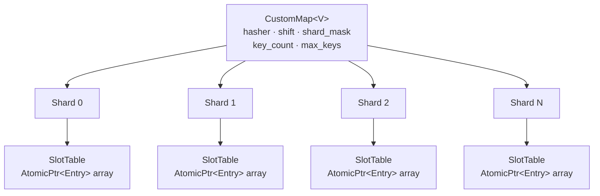

The three layers:

1. **`CustomMap`** — the public facade. Computes the hash and routes to the right shard.
2. **`Shard`** — owns one `SlotTable` and coordinates structural insertion and growth. Its mutex is used only during resize.
3. **`SlotTable`** — a flat array of stable entry pointers. Linear probing finds an entry; the entry's packed atomic state coordinates occupancy, locking, and sequence validation.

### The Actual Memory Layout

The map stores each value inline inside a stable entry. A slot points to an `Entry<V>` allocated with `rust-zmalloc`; the entry owns a compact key, a `MaybeUninit<V>`, and one packed state word:

```rust
struct Entry<V> {
    hash: u64,
    key: CompactKey,
    state: AtomicU64,
    value: UnsafeCell<MaybeUninit<V>>,
}

struct SlotTable<V> {
    slots: Box<[AtomicPtr<Entry<V>>]>,
    mask: usize,
    threshold: usize,
}

struct CustomMap<V> {
    shards: Box<[Shard<V>]>,
    shift: u32,
    shard_mask: usize,
    hasher: RandomState,
    key_count: CachePadded<AtomicUsize>,
    max_keys: usize,
}

#[repr(align(128))]
struct Shard<V> {
    table: AtomicPtr<SlotTable<V>>,
    len: CachePadded<AtomicUsize>,
    insert_gate: CachePadded<AtomicUsize>,
    grow_lock: Mutex<()>,
}
```

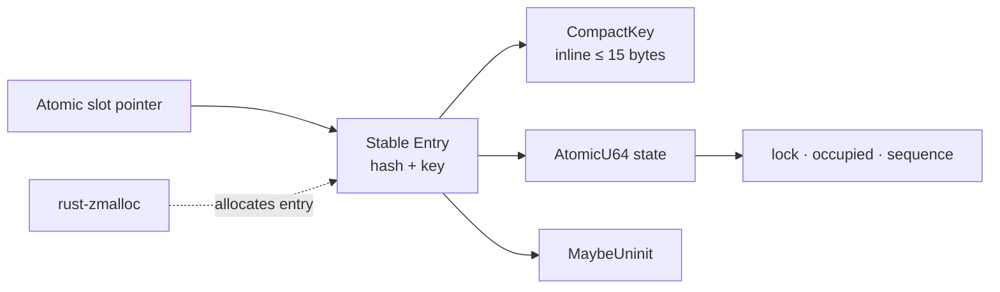

Keeping the value inline removes a pointer chase and a separate value allocation for every key. The state word packs three pieces of metadata: bit 0 is the writer lock, bit 1 says whether the entry is logically occupied, and the remaining bits form a sequence counter. Writers update `V` under the lock, while readers use the occupied bit and EBR to keep the entry alive during access.

The `#[repr(align(128))]` shard alignment and cache-padded length/gate counters reduce false sharing. Threads modifying shard 0's insertion state should not constantly invalidate the cache line containing shard 1's hot metadata. At map level, `key_count` tracks live values while `max_keys` controls admission in the fallible insertion APIs.

### Capacity and Admission

`SlotTable::new` rounds capacity upward and stores `mask = capacity - 1`. Tables start at only eight slots, and `with_capacity` also starts each shard lazily at that size instead of reserving the entire expected key set up front. This is the main idle-RSS improvement.

```rust
let cap = cap.next_power_of_two().max(8);
let mask = cap - 1;
let threshold = cap * 9 / 10;
```

At a capacity of 1,024, growth begins at 921 live reservations. The higher threshold is viable because growth is coordinated by the insertion gate; lazy initial tables avoid paying for unused capacity.

`with_capacity(shard_count, expected_keys)` now uses `expected_keys` as an admission limit, not as an instruction to allocate all table space immediately. The fallible APIs check that limit before admitting a new live key:

```rust
pub fn try_insert(&self, key: String, value: V) -> Result<bool, Full> {
    if self.key_count.load(Ordering::Relaxed) >= self.max_keys {
        let (hash, shard) = self.locate(&key);
        let exists = ebr::with_pin(|_| {
            self.shards[shard].find(&key, hash)
                .is_some_and(|e| !e.value.load(Ordering::Acquire).is_null())
        });
        // Existing keys may still be updated at capacity.
        if !exists {
            return Err(Full);
        }
    }
    Ok(self.insert(key, value))
}
```

`try_set` follows the same rule. Updating an existing key is permitted because it does not increase cardinality. `with_shards` uses `usize::MAX`, effectively disabling this admission ceiling, and the infallible `insert`/`set` APIs continue to grow normally.

The check is intentionally lightweight: it is a relaxed preflight check rather than a global key-count reservation. It avoids adding a contended global CAS to every insertion; callers requiring a strict concurrent hard ceiling need coordination above the map.

---

## Layer 1 — Routing: How a Key Finds Its Shard

```rust
#[inline(always)]
fn locate(&self, key: &str) -> (u64, usize) {
    let h = self.hasher.hash_one(key);
    (h, ((h >> self.shift) as usize) & self.shard_mask)
}
```

The **top bits** of the hash select the shard, and the **lower bits** are used for slot indexing inside that shard. This spreads load evenly across all shards.

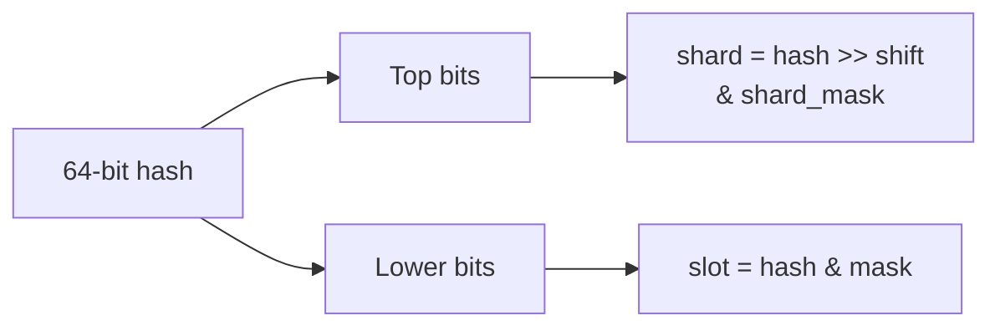

`foldhash::fast::RandomState` is selected for hashing throughput and per-map randomization. It is not a cryptographic hash, so untrusted adversarial keys require a separate denial-of-service assessment.

---

## Layer 2 — The SlotTable: Lock-Free Open Addressing

Each `Shard` holds a `SlotTable`: a boxed slice of `AtomicPtr<Entry<V>>`. Slots default to `null`.

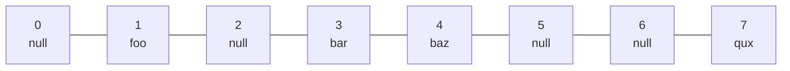

**Linear Probing** — if slot `i` is taken, try `i+1`, `i+2`, etc. (modulo capacity).

### Reading — Zero Locks

```rust
fn find(&self, key: &str, hash: u64) -> Option<&Entry<V>> {
    let t = self.table();
    let mut i = (hash as usize) & t.mask;
    loop {
        let p = unsafe { t.slots.get_unchecked(i) }.load(Ordering::Acquire);
        if p.is_null() {
            return None;              // empty slot = key not here
        }
        let e = unsafe { &*p };
        if e.hash == hash && e.key == key {
            return Some(e);           // found it
        }
        i = (i + 1) & t.mask;        // probe next
    }
}
```

`Acquire` load ensures we see all writes to the entry that happened before the `Release` store that put the pointer there. The updated read APIs pin **before loading and traversing the table**, so an old table generation cannot be reclaimed while a reader is still probing it. Reads take no mutex and never enter the insertion gate.

### Read APIs and Consistency Trade-offs

| API                    | Synchronization          | Best use                                      |
| ---------------------- | ------------------------ | --------------------------------------------- |
| `get(key)`             | EBR pin + clone          | replacement-only workloads                    |
| `get_ref(key)`         | EBR guard in `ValueRef`  | short borrowed access without cloning         |
| `with_entry(...)`      | EBR pin during closure   | precomputed hash/shard access                 |
| `get_locked(key, ...)` | per-entry spin lock      | read coordinated with in-place mutation       |
| `read_consistent(...)` | sequence check and retry | experimental optimistic read; see safety note |

`get_ref` ties the borrowed pointer to an EBR guard:

```rust
pub struct ValueRef<'a, V> {
    ptr: *const V,
    _guard: ebr::Guard,
    _map: PhantomData<&'a CustomMap<V>>,
}
```

The guard is not decoration. Its `Drop` implementation unpins the thread. As long as the `ValueRef` exists, reclamation cannot recycle the pointed-to value. Holding it for a long time is safe, but it can delay reclamation for every retired value waiting on that epoch.

EBR protects allocation lifetime; it does not by itself synchronize an in-place write to the fields inside `V`. `get_locked` is the coordinated reader for `update_with`. Plain `get`, `get_ref`, and `with_entry` are appropriate when values are replaced through the atomic pointer rather than mutated in place. The sequence-based path is intended as an optimistic alternative, but it has an important Rust memory-model limitation discussed in the update section.

`read_consistent` is a small seqlock-style loop:

```rust
loop {
    let seq1 = entry.seq.load(Ordering::Acquire);
    if seq1 & 1 != 0 { continue; }

    let ptr = entry.value.load(Ordering::Acquire);
    if ptr.is_null() { return None; }
    let result = f(unsafe { &(*ptr).0 });
    atomic::fence(Ordering::Acquire);

    if seq1 == entry.seq.load(Ordering::Acquire) {
        return Some(result);
    }
}
```

An odd sequence means an in-place writer is active. A changed sequence means a writer overlapped the callback, so the callback runs again against a stable observation.

---

## Layer 3 — EBR: Safe Memory Reclamation Without GC

Here's the hard problem: Thread A reads an entry while Thread B clears, compacts, or replaces the table containing that entry. Without reclamation, Thread A could dereference freed entry storage. 💥

The solution is **Epoch-Based Reclamation (EBR)**, implemented in `ebr.rs`.

### How Epochs Work

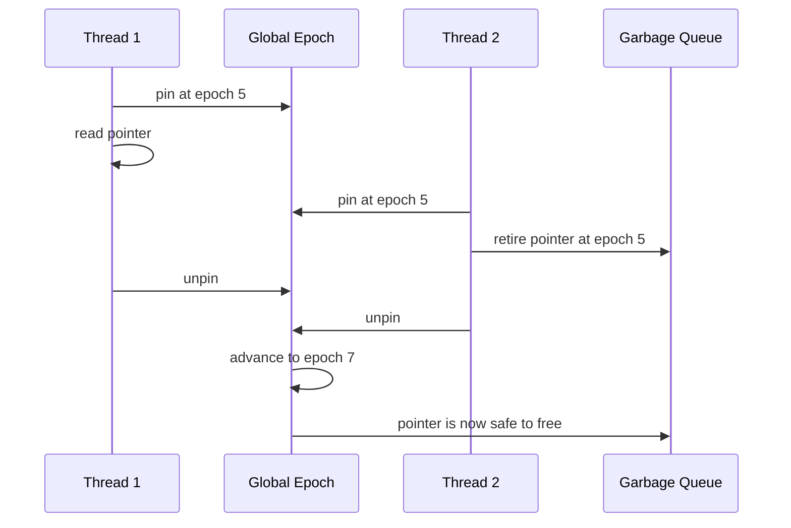

Every thread registers a `Participant` with its own `local` epoch:

```rust
struct Participant {
    local: CachePadded<AtomicU64>,  // current epoch while active, 0 = inactive
    next: *mut Participant,          // intrusive linked list
}
```

When a thread wants to read safely, it **pins** — snapping its local epoch to the global one:

```rust
fn pin(&mut self) {
    if self.depth == 1 {
        loop {
            let e = GLOBAL_EPOCH.load(Relaxed);
            participant.local.store(e, Release);
            fence(Acquire);
            if GLOBAL_EPOCH.load(Acquire) == e { break; }
            participant.local.store(INACTIVE, Release);
        }
    }
}
```

When it unpins, it stores `INACTIVE`. The collector only advances the global epoch if **every active thread** has caught up — proving no active participant is still protected by an older epoch.

### What the Collector Actually Stores

Retired entries and table allocations are not dropped immediately. Each thread has a thread-local `Local` record containing its participant pointer, nesting depth, retired garbage, and a collection-on-unpin flag:

```rust
struct Local {
    participant: *const Participant,
    garbage: Vec<Garbage>,
    depth: usize,
    retires: usize,
    collect_on_unpin: bool,
    initialized: bool,
}
```

Collection normally runs every 512 retirements. An item retired at epoch `e` becomes reclaimable when the observed safe epoch satisfies `e + 2 <= safe`. The current collector drops retired entries and tables through their type-specific destruction callbacks; there is no value-allocation pool in this version. `rust-zmalloc` owns the raw allocation and is called when an entry or table is finally reclaimed.


Nested reads are supported with `depth`. Only the outermost pin publishes an epoch, and only the final unpin marks the participant inactive. This avoids accidentally leaving a nested operation unprotected.

---

## Multi-Thread Access: What Actually Happens

Let's trace four threads hitting the map simultaneously.

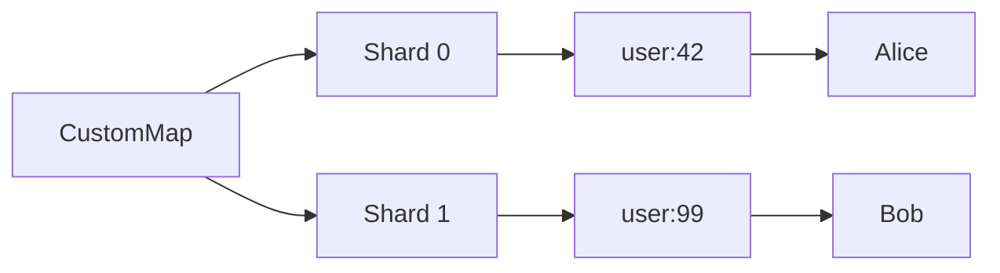

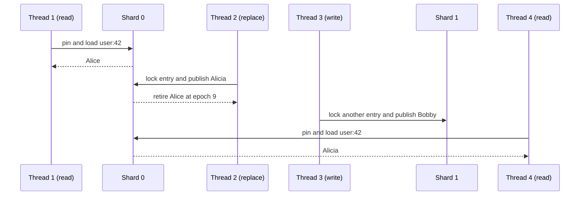

Key insight: the lock is attached to an entry, not the shard. Writers updating `user:42` serialize with each other, but a writer for `user:99` proceeds independently even when both keys happen to share a shard. Pinned readers keep the stable entry alive while table generations are replaced.

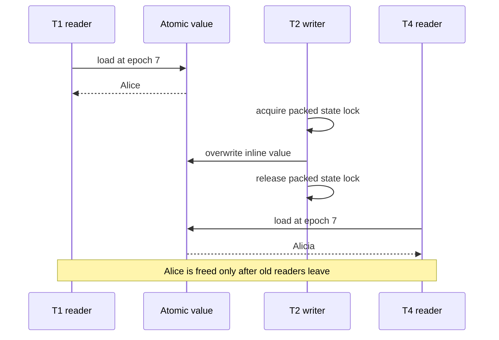

---

## The `insert` Path with CAS Loop

When inserting a _new_ key, we need to atomically claim a slot. The CAS loop:

```rust
if slot.compare_exchange(
    ptr::null_mut(),   // expected: slot is empty
    entry,             // desired: our new entry
    Ordering::Release,
    Ordering::Acquire,
).is_ok() {
    return true;  // we won the race
}
// Another thread grabbed this slot first — probe next
```

Two threads racing to insert different keys at the same slot:

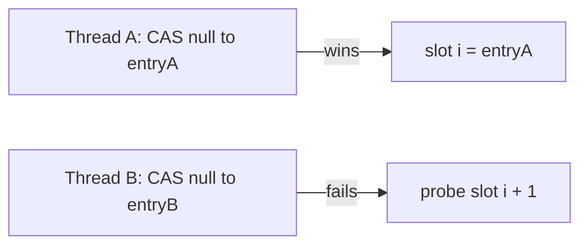

No lost inserts. No corruption. Pure atomics.

### Why Insertion Reserves Length Before Publishing

When an empty slot is found, the implementation first reserves capacity by incrementing the shard length with `compare_exchange_weak`. Only then does it publish the entry pointer into the slot. This prevents many racing writers from all passing the load-factor check and overfilling the table.

There is another race to handle: after allocating an entry, a writer may discover that another thread inserted the same key. The losing writer locks the existing entry, drops its old inline value if occupied, moves the privately allocated value into the existing `MaybeUninit<V>`, and marks the private entry unoccupied before destroying it:

```rust
if reserved {
    self.len.fetch_sub(1, Ordering::Relaxed);
}
state_lock(&existing.state);
if state_occupied(&existing.state, Ordering::Relaxed) {
    unsafe { (*existing.value.get()).assume_init_drop() };
}
let moved = unsafe { (*(*entry).value.get()).assume_init_read() };
unsafe { (*existing.value.get()).write(moved) };
state_set_occupied(&existing.state, true, Ordering::Release);
state_unlock(&existing.state);

state_set_occupied(&unsafe { &*entry }.state, false, Ordering::Relaxed);
unsafe { drop_raw_entry::<V>(entry.cast()) };
```

The occupied-bit handoff is the ownership boundary. Clearing it on the private entry prevents `Entry::drop` from dropping the value a second time after it has been moved.

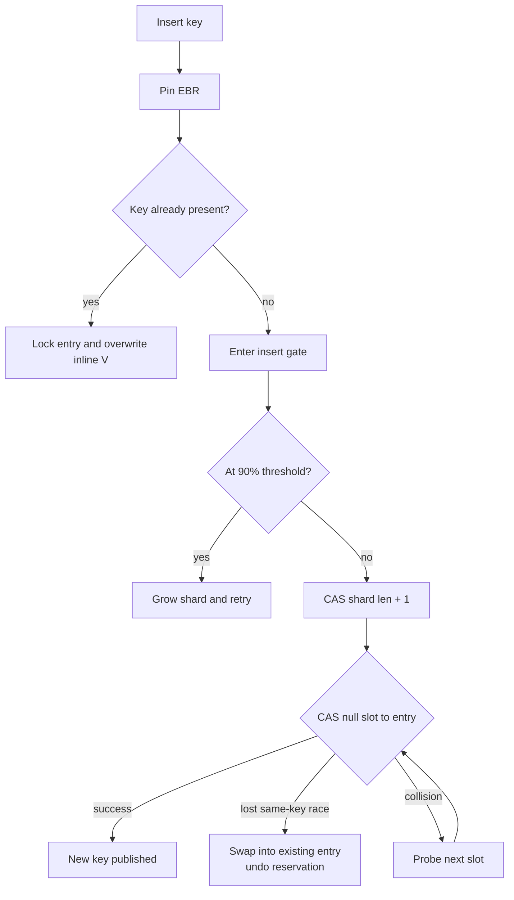

## Two Update Modes

The current implementation keeps both update styles inside the stable entry. `update` acquires the packed state lock, asks the closure to build a replacement, drops the old inline value, and writes the new value into the same storage:

```rust
state_lock(&entry.state);
if !state_occupied(&entry.state, Ordering::Relaxed) {
    state_unlock(&entry.state);
    return None;
}

let (new_val, result) = f(unsafe { (*entry.value.get()).assume_init_ref() });
state_seq_add(&entry.state, Ordering::Release);
unsafe { (*entry.value.get()).assume_init_drop() };
unsafe { (*entry.value.get()).write(new_val) };
state_seq_add(&entry.state, Ordering::Release);
state_unlock(&entry.state);
```

The closure runs once after the writer owns the entry lock. There is no new entry allocation, pointer publication, or EBR retirement for an ordinary update. The trade-off is that a slow closure delays other locked operations on that key. `try_update` uses the same lock but lets the closure cancel publication by returning `None`.

### In-Place Mutation with `update_with`

The newest API adds an ergonomic mutation form without exposing shared mutable memory:

```rust
map.update_with("user:42", |user| {
    user.login_count += 1;
    user.last_seen = now;
});
```

`update_with` locks the entry and mutates the inline `V` directly. Before calling the closure it increments the packed sequence to an odd number; after the closure it increments again to an even number.

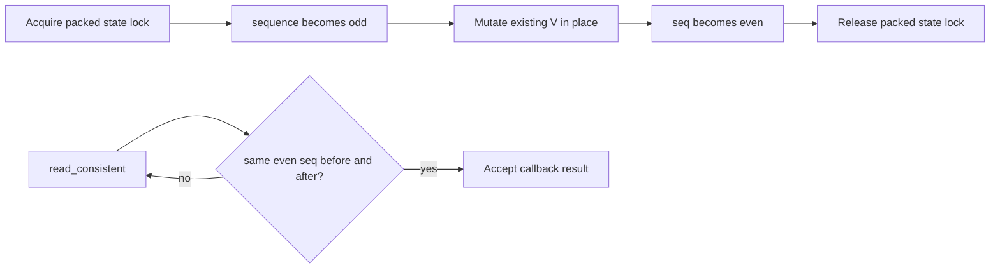

This avoids constructing a replacement value when the caller can safely edit in place. `get_locked` provides the straightforward coordinated read path.

There is an important Rust memory-model boundary in the current source. A seqlock can detect that a writer overlapped a read, but detection after the fact does not make an unsynchronized `&V` read concurrent with `&mut V` legal for arbitrary `V`. As currently implemented, `read_consistent`, plain `get`, `get_ref`, `with_entry`, iteration, and slot inspection can overlap `update_with` without taking the packed state lock. Until every access path follows one synchronization protocol, concurrent use of the in-place path is not sound for arbitrary `V`.

## Removal Is Logical, Not Structural

Deletion locks the entry, drops its inline value, clears the occupied bit, and leaves the `Entry` in its slot:

```rust
state_lock(&entry.state);
if state_occupied(&entry.state, Ordering::Relaxed) {
    state_seq_add(&entry.state, Ordering::Release);
    unsafe { (*entry.value.get()).assume_init_drop() };
    state_set_occupied(&entry.state, false, Ordering::Release);
    state_seq_add(&entry.state, Ordering::Release);
    self.key_count.fetch_sub(1, Ordering::Relaxed);
}
state_unlock(&entry.state);
```

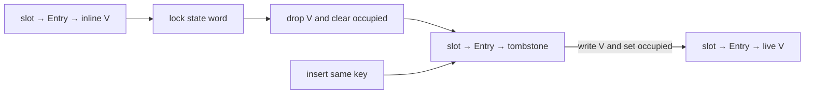

Keeping the entry shell is essential for the current probing algorithm. Turning the slot itself back into null could break a collision chain and cause lookups for later keys to stop too early. The same key can be resurrected by writing a new inline value and setting `STATE_OCCUPIED`; an unrelated key does not reuse that occupied entry slot until growth or explicit compaction.

The public API now offers three removal costs:

| API                    | Result                         | Why it exists                               |
| ---------------------- | ------------------------------ | ------------------------------------------- |
| `remove(key)`          | cloned removed `V`             | caller needs ownership of the old value     |
| `remove_no_clone(key)` | `bool`                         | delete without paying the clone cost        |
| `remove_with(key, f)`  | callback result derived from V | inspect the old value while still protected |

`remove_with` runs its callback while holding the entry lock and EBR pin, then retires the allocation. The callback should therefore stay short.

Growth now compacts those tombstones while it rehashes. It counts only entries with `STATE_OCCUPIED`, retires unoccupied entry allocations, and stores that `live_count` back into the shard's `len` after the new table is built. The old table is then retired through EBR. This prevents deleted entries from making the shard appear permanently full and restores the load-factor calculation to the number of live entries.

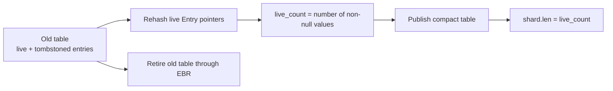

---

## Resizing — The One Lock

Growing the table is the _only_ place a shard uses a mutex, and only to serialize competing growth attempts. Readers are never blocked. New-key insertion has one additional atomic coordination mechanism: an `insert_gate` whose high bit means `GROWING` and whose remaining bits count active inserters.

```rust
fn grow(&self) {
    let _lock = self.grow_lock.lock().unwrap_or_else(|e| e.into_inner());

    while self.insert_gate.compare_exchange_weak(
        0,
        GROWING,
        Ordering::AcqRel,
        Ordering::Relaxed,
    ).is_err() {
        std::hint::spin_loop();
    }

    self.grow_locked();
    self.insert_gate.store(0, Ordering::Release);
}
```

### Why the Insert Gate Was Added

Without a gate, an inserter could load the old table while a growing writer copies its slots, then publish a new entry into that old table after the copy has passed that slot. The new table would never receive the entry. The gate closes that race:

1. An inserter atomically increments the active-inserter count unless `GROWING` is set.
2. Its `InsertGuard` decrements the count on every return path through `Drop`.
3. A growing writer holds `grow_lock` and CAS-es the gate from exactly `0` to `GROWING`.
4. Reaching `GROWING` proves every old-table inserter has exited.
5. The writer copies live entries, publishes the new table, retires the old table, then reopens insertion.

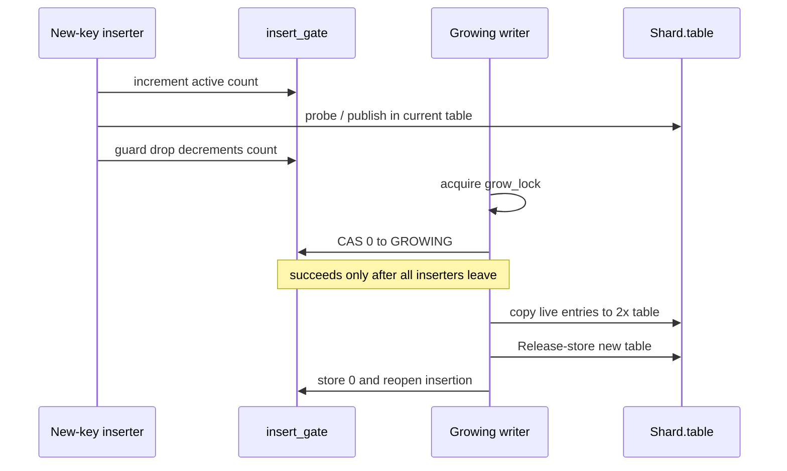

Existing-key updates lock and rewrite the stable entry in place and do not require this gate. The gate specifically protects structural publication of new entries during table migration.

### Old Tables Are Now Reclaimed

After copying live entries, growth publishes the new pointer and retires the old table through EBR:

```rust
let new_ptr = Box::into_raw(new_table);
self.table.store(new_ptr, Ordering::Release);
unsafe { ebr::retire_box(old_ptr) };
```

Every public operation that traverses table slots is pinned while it loads and uses the table pointer. Therefore the old `SlotTable` and its entry allocations remain alive until all readers that could have observed them leave their critical sections. Both are then destroyed through their raw-allocation callbacks.

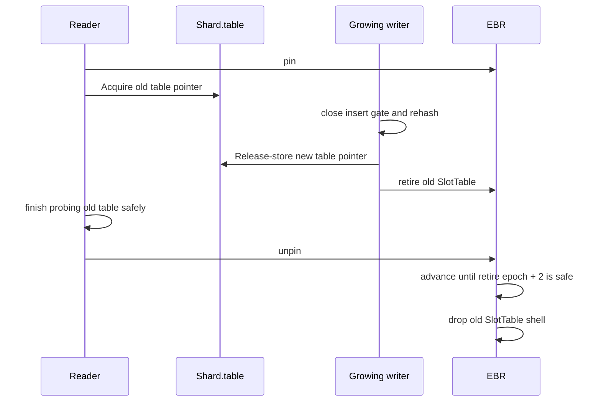

Readers never take `grow_lock` or touch `insert_gate`; the mutex prevents multiple writers from rebuilding the same shard, while the gate creates a clean migration boundary for new entries. A writer that waited for the lock rechecks the threshold because another writer may already have completed the growth.

## Atomic Ordering: Why Each One Is There

| Operation           | Ordering            | Reason                                                          |
| ------------------- | ------------------- | --------------------------------------------------------------- |
| load shard table    | `Acquire`           | observe the initialized table published by a writer             |
| load entry slot     | `Acquire`           | observe the fully initialized entry                             |
| publish new entry   | `Release`           | make entry initialization visible before readers dereference it |
| rewrite inline value | lock + `Release`   | serialize `MaybeUninit<V>` access and publish state transitions |
| clear occupied bit  | `Release`           | publish logical deletion before another reader observes it      |
| acquire entry lock  | `Acquire`           | prevent later value access from moving before lock ownership    |
| release entry lock  | `Release`           | publish locked mutations before the next lock owner proceeds    |
| sequence counter    | `Release`/`Acquire` | mark and detect an overlapping in-place mutation                |
| length counters     | `Relaxed`           | counters coordinate capacity/accounting, not entry contents     |
| enter insert gate   | `Acquire`           | begin structural insertion only when growth is not active       |
| leave insert gate   | `Release`           | make the inserter's completion visible to a growing writer      |
| close gate for grow | `AcqRel`            | exclude new inserters after all current inserters have drained  |

Using `SeqCst` everywhere would be easier to explain but stronger than the algorithm needs. The implementation builds explicit publication edges around pointer ownership while allowing independent operations to reorder where correctness does not depend on their global order.

## Safety Invariants Behind the `unsafe`

Raw pointers make the hot path small, but correctness depends on invariants that the type system cannot verify by itself:

1. A slot pointer is published only after its `Entry` is fully initialized.
2. Published entry shells remain stable while concurrent operations may find them.
3. An inline `V` is accessed only while the thread is pinned and the entry state makes that access valid.
4. An inline value is dropped exactly once before the occupied bit is cleared or the entry is retired.
5. Raw entry and table allocations are released through the matching `rust-zmalloc` layout.
6. Table capacity is a power of two, making `hash & mask` valid.
7. The 90% threshold leaves null slots, so an unsuccessful probe terminates.
8. Growth begins only after the insert gate reaches zero, so no entry can be published into the old table after migration starts.
9. Every table traversal is pinned before its table pointer is loaded, allowing old tables to be retired safely.
10. Access to the fields inside `V` must also be synchronized; EBR protects lifetime, not concurrent `&V`/`&mut V` aliasing.

The first nine invariants describe the packed-state, allocation, and table design. The tenth is where the current in-place `update_with` flow still needs a unified reader/writer protocol before it can be treated as sound for arbitrary values.

---

## Performance Characteristics

| Operation             | Contention / allocation cost                   | Cost                |
| --------------------- | ---------------------------------------------- | ------------------- |
| `get`                 | lock-free pointer read + clone                 | O(1) amortized      |
| `get_ref`             | lock-free read; pins until guard drop          | O(1) amortized      |
| `get_locked`          | one entry spin lock                            | O(1) amortized      |
| `read_consistent`     | optimistic sequence retries                    | O(1) amortized      |
| `insert` existing key | one atomic value swap                          | O(1) amortized      |
| `insert` new key      | insert gate + length CAS + slot CAS            | O(1) amortized      |
| `update`              | entry lock + inline drop/write                 | O(1) amortized      |
| `update_with`         | entry lock; no clone or replacement allocation | O(1) amortized      |
| `remove_no_clone`     | entry lock + drop inline value                | O(1) amortized      |
| `try_insert` new key  | max-key preflight + normal insert              | O(1) amortized      |
| `grow`                | writer mutex + drained insert gate             | O(entries in shard) |
| `for_each`            | one EBR pin per shard                          | O(total slots)      |
| `retain` / `clear`    | shard pin + per-entry state lock               | O(total slots)      |

With 16 shards in this configuration, growth is isolated to 1/16th of the keyspace at a time.

---

## Putting It All Together: A Real Example

```rust
use std::sync::Arc;
use std::thread;

fn main() {
    // 16 shards, 10_000 expected keys
    let map = Arc::new(CustomMap::<u64>::with_capacity(16, 10_000));

    let mut handles = vec![];

    // 8 writer threads
    for t in 0..8u64 {
        let m = Arc::clone(&map);
        handles.push(thread::spawn(move || {
            for i in 0..1000u64 {
                m.insert(format!("thread:{t}:key:{i}"), t * 1000 + i);
            }
        }));
    }

    // 4 reader threads
    for _ in 0..4 {
        let m = Arc::clone(&map);
        handles.push(thread::spawn(move || {
            for t in 0..8u64 {
                for i in 0..1000u64 {
                    // may return None if writer hasn't inserted yet — that's fine
                    let _ = m.get(&format!("thread:{t}:key:{i}"));
                }
            }
        }));
    }

    for h in handles { h.join().unwrap(); }

    println!("Total keys: {}", map.len()); // 8000
}
```

All 12 threads run concurrently. This replacement-only example keeps reads lock-free and avoids any map-wide `Mutex` or `RwLock`; growth alone takes a shard mutex. The EBR layer ensures that replaced or removed allocations are not reclaimed while pinned readers may still hold their pointers.

## Iteration Is Weakly Consistent

`for_each` and `keys` pin one shard at a time. Retention scans keep a shard pinned while walking its slots, then lock each live entry before dropping it. `retain_shard_range` adds bounded continuation: callers can process a slice of slots and resume from the returned cursor, which is useful for maintenance work budgets.

None of these operations creates a global snapshot. An iteration may see an update in one shard and miss a later update in another. That is acceptable for diagnostics, maintenance passes, shard-local expiry cleanup, and eventually consistent views, but not for transactions or exact point-in-time exports.

`retain`, `retain_shard`, and `retain_shard_range` use the same packed-state deletion mechanism as `remove`: drop the inline value, clear `STATE_OCCUPIED`, and leave the entry shell in its probe position. `compact_shard` can then rebuild a smaller table when tombstones and over-allocation justify it. `clear` takes the shard growth gate, swaps in a fresh eight-slot table, retires every old entry and the old table through EBR, resets the global count, and calls `force_collect`.

`defragment_values(budget, rebuild)` provides bounded active defragmentation: it walks keys and calls `update_with` for at most `budget` values, preserving entry addresses while allowing nested allocations inside `V` to be rebuilt. `peek_slot` and `peek_slot_with` expose shard/slot inspection for storage-layer scans, while `shard_layout_matches` verifies capacities without exposing raw pointers.

## Regression Coverage

The crate now covers four structural boundaries directly: bounded `retain_shard_range` visits each slot once; four readers survive repeated growth while four writers add 8,000 keys; `clear` races with active readers and writers; and repeated clear cycles reclaim old generations without invalidating fresh tables. Together these tests exercise cursor-based maintenance, the insertion gate, table publication, packed-state deletion, and EBR reclamation.

## When This Design Fits—and When It Does Not

Use this style of map when reads dominate, keys are strings, values are cloneable or can be borrowed briefly, and latency under contention matters enough to justify unsafe code and custom reclamation.

Prefer a simpler locked map when the workload is small, operations must mutate values in place, iteration requires a snapshot, memory reclamation must be immediate, or the team cannot continuously audit unsafe concurrency invariants. A well-sharded mutex design is often the better engineering decision even if its benchmark peak is lower.

The [full source is on GitHub](https://github.com/Rana718/FlashDB/tree/main/crates/customhash) if you want to dig deeper.
