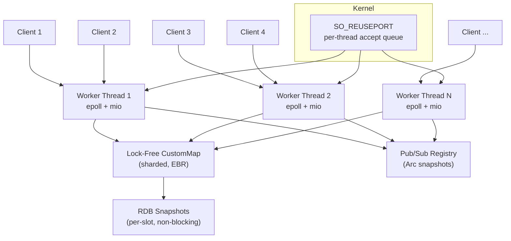
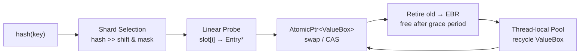
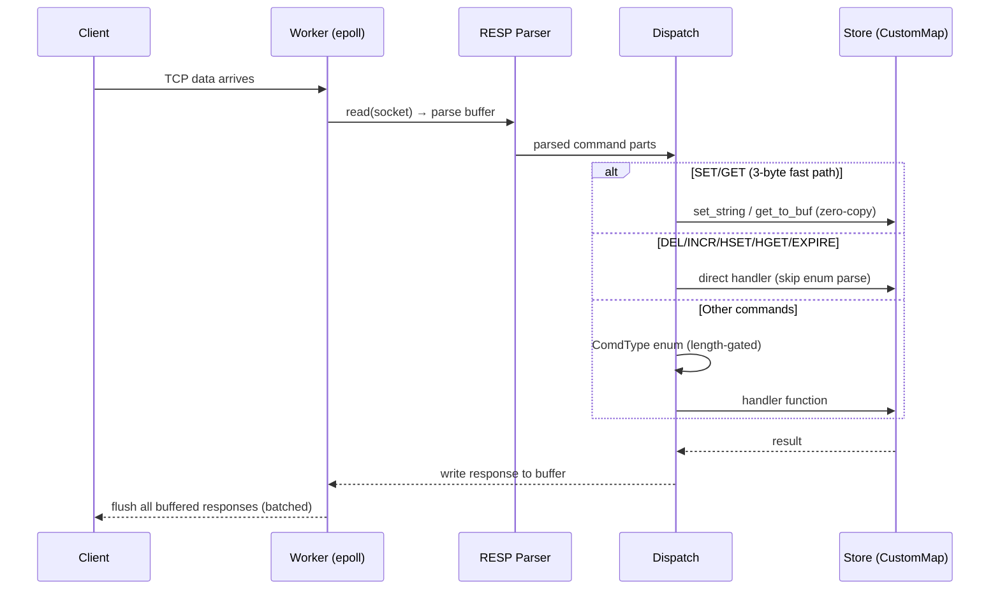

Redis is fast. It handles hundreds of thousands of operations per second on a single thread. But what if a single node, using all available CPU cores, could outperform an entire Redis Cluster?

FlashDB is an in-memory key-value store that speaks the Redis RESP protocol. Any Redis client connects without modification. Under the hood, it replaces Redis's single-threaded event loop with a **thread-per-core architecture** backed by a **fully lock-free concurrent hash map**. No mutex, no RwLock on the data path.

The result: a single FlashDB node on 6 cores outperforms a 6-node Redis Cluster by 2–5x.

```
┌────────────────────────────────────────────────────────────────┐
│ Metric           │ FlashDB (6 cores)  │ Redis Cluster (6 nodes)│
├────────────────────────────────────────────────────────────────┤
│ Pipeline-64 SET  │ ~14.7M ops/sec     │ ~3.5M ops/sec          │
│ Pipeline-100 SET │ ~14.9M ops/sec     │ ~7.9M ops/sec          │
│ Pipeline-100 GET │ ~19.3M ops/sec     │ ~8.3M ops/sec          │
│ Pub/Sub delivery │ ~36.8M msg/sec     │ ~7.3M msg/sec          │
└────────────────────────────────────────────────────────────────┘
```

## Quick Start

```bash
cargo build --release
./target/release/flash_db
```

Connect with any Redis client:

```bash
redis-cli -p 8000
127.0.0.1:8000> SET user:1 "rana"
OK
127.0.0.1:8000> GET user:1
"rana"
127.0.0.1:8000> HSET session:abc token "xyz123" expires "3600"
(integer) 2
127.0.0.1:8000> HGETALL session:abc
1) "token"
2) "xyz123"
3) "expires"
4) "3600"
127.0.0.1:8000> INCR page:views
(integer) 1
127.0.0.1:8000> SET cache:item "data" EX 60
OK
127.0.0.1:8000> TTL cache:item
(integer) 60
127.0.0.1:8000> SUBSCRIBE events
Reading messages...
```

Or with Docker:

```bash
docker run -p 8000:8000 rana718/flashdb:latest
```

## Why Build Another Redis?

Redis is single-threaded by design. To scale, you deploy a cluster — 6 nodes, 3 masters + 3 replicas. That means 6 processes, client-side routing, resharding complexity, and 6x the operational surface.

FlashDB asks: **what if one process could use all cores safely?** Not by adding a lock around the hash map, but by making the hash map itself lock-free.

## Architecture



Each worker thread runs its own `epoll` loop via `mio`. The kernel distributes incoming connections across workers using `SO_REUSEPORT` — no accept contention. All workers share the same `CustomMap` through `Arc`, but the map itself uses atomic operations internally — no shared locks.

## The Lock-Free Hash Map

FlashDB is built on a custom concurrent hash map with epoch-based reclamation. I wrote a detailed article about the design and implementation: [Building a Lock-Free Concurrent HashMap in Rust from Scratch](https://www.ranadolui.me/blog/custom-concurrent-hashmap-rust).

Key properties:
- **Reads are wait-free** — pure atomic loads, no CAS, no lock
- **Writes are lock-free** — single atomic swap for updates, CAS for inserts
- **Deleted values are reclaimed safely** — epoch-based reclamation ensures no use-after-free
- **Value pooling** — retired ValueBoxes are recycled, so steady-state SET does zero malloc
- **Sharded** — N shards (power of two), 128-byte aligned to eliminate false sharing



## How a Request Flows



Three-tier dispatch:
1. **Inline fast path**: 3-byte command check directly from raw bytes. `SET key value` (no options) and `GET key` are handled without building any string array.
2. **First-byte fast path**: DEL, INCR, HSET, HGET, EXPIRE routed by first character — skip the full enum parse.
3. **Length-gated enum**: remaining commands matched by length first (single integer compare), then case-insensitive byte compare.

## Zero-Copy GET

The GET path never allocates a String. It writes directly from the stored value into the TCP write buffer:

```rust
pub fn get_to_buf(&self, key: &str, out: &mut Vec<u8>) -> bool {
    let (h, idx) = self.data.locate_key(key);
    self.data.with_entry(key, h, idx, |val| {
        if val.is_expired() { return Err(()); }
        match val.value.as_string() {
            Some(s) => {
                write_bulk(out, s);  // write "$len\r\nvalue\r\n" directly
                Ok(true)
            }
            None => Ok(false),
        }
    })
    // ...
}
```

The EBR pin ensures the value stays alive while we write it to the buffer. No clone. No intermediate String. The value bytes go straight from the hash map slot to the kernel TCP buffer.

## In-Place Mutations

INCR, HSET, HDEL, APPEND, EXPIRE — these commands modify a value. The naive approach is: clone the entire value, modify the clone, CAS-swap it in. For a hash with 1000 fields, that means cloning all 1000 fields just to increment one counter.

FlashDB uses `update_with()`:

```rust
pub fn update_with<R>(&self, key: &str, f: impl FnMut(&mut V) -> R) -> Option<R> {
    // 1. Find entry
    // 2. Clone value (one internal clone)
    // 3. Call f(&mut clone) — mutate in-place
    // 4. CAS old_ptr → new_ptr
    //    if CAS fails (concurrent modification): retry from step 2
    // 5. Retire old value via EBR
}
```

The caller never sees the clone. For HDEL, the mutation is just `h.remove(field)` on the cloned HashMap — no second clone at the call site.

## Pub/Sub: 36.8 Million Messages Per Second

The publish path holds **zero locks**:


- **Arc snapshot**: subscribe/unsubscribe creates a new `Arc<Vec<ChannelData>>` and swaps it in. Publishers clone the Arc (one atomic increment) and iterate safely — even if subscriptions change concurrently.
- **Single frame allocation**: `encode_message()` returns `Arc<[u8]>` directly. All 50 subscribers share the same bytes.
- **First-byte pattern index**: PSUBSCRIBE patterns are bucketed by first character. PUBLISH only checks the relevant bucket, not all patterns.

## Persistence

FlashDB uses RDB snapshots (same model as Redis):

- **Atomic writes**: write to temp file → fsync → rename. A crash mid-save never corrupts the existing snapshot.
- **Per-slot iteration**: each slot is pinned briefly via EBR, then released. Garbage collection proceeds normally between slots — no multi-second GC stalls.
- **Automatic saves**: every 5 minutes (configurable), on SIGTERM/SIGINT, and via `BGSAVE` command.
- **Capacity enforcement**: `max_keys` limit prevents OOM — returns error when full instead of crashing.

## Configuration

All via environment variables with production-ready defaults:

```bash
FLASHDB_PORT=8000         # TCP port
FLASHDB_WORKERS=0         # 0 = auto (number of CPU cores)
FLASHDB_MAX_KEYS=1000000  # Hash table sizing + admission limit
FLASHDB_MAX_CLIENTS=10000 # Max concurrent connections
FLASHDB_RDB_PATH=flashdb.rdb
FLASHDB_RDB_INTERVAL=300  # Auto-save every 5 minutes
```

## Supported Commands

FlashDB implements the most-used Redis commands:

**Strings**: SET (with EX/PX/NX/XX/GET), GET, MSET, MSETNX, MGET, INCR, DECR, INCRBY, DECRBY, INCRBYFLOAT, APPEND, STRLEN, GETRANGE, SETRANGE, GETDEL, GETSET, GETEX, SETNX, SETEX, PSETEX

**Keys**: DEL, UNLINK, EXISTS, TTL, PTTL, EXPIRE, PEXPIRE, EXPIREAT, PERSIST, RENAME, RENAMENX, COPY, RANDOMKEY, KEYS, SCAN

**Hashes**: HSET, HSETNX, HGET, HMGET, HMSET, HGETALL, HDEL, HEXISTS, HLEN, HKEYS, HVALS, HINCRBY, HINCRBYFLOAT

**Pub/Sub**: SUBSCRIBE, UNSUBSCRIBE, PSUBSCRIBE, PUNSUBSCRIBE, PUBLISH, PUBSUB CHANNELS/NUMSUB/NUMPAT

**Server**: PING, ECHO, INFO, DBSIZE, FLUSH, BGSAVE, TYPE

## Performance Characteristics

| Operation | Complexity | Mechanism |
|-----------|-----------|-----------|
| GET | O(1) | Wait-free probe + atomic load + zero-copy write |
| SET | O(1) | Lock-free probe + atomic swap + EBR retire |
| INCR/EXPIRE | O(1) | In-place mutation via CAS loop |
| HSET/HDEL | O(1) | Clone + mutate + CAS (no caller-side clone) |
| MGET (100 keys) | O(k) | k direct-to-buffer writes, zero allocation |
| PUBLISH | O(s+p) | s = subscribers, p = matching pattern bucket |
| RANDOMKEY | O(1) avg | Random shard + sequential slot probe |
| INFO | O(1) | Atomic counter read |
| KEYS | O(n) | Per-shard scan (GC between shards) |

## Resource Usage

```
┌─────────────────────────────────────────────────────────────────┐
│                   │ FlashDB (1 node)  │ Redis Cluster (6 nodes) │
├─────────────────────────────────────────────────────────────────┤
│ Idle RSS          │ ~55 MB            │ ~75 MB (total)          │
│ Peak RSS          │ ~235 MB           │ ~154 MB (total)         │
│ Peak CPU          │ ~60%              │ ~96%                    │
│ Throughput        │ 14-19M ops/sec    │ 3.5-8.3M ops/sec       │
└─────────────────────────────────────────────────────────────────┘
```

FlashDB uses more memory (pre-allocated lock-free hash table with ~35% load factor for short probe chains) but delivers 2–5x the throughput on less CPU.

## What Makes It Production-Grade

- **Memory safety**: all lock-free operations verified — no use-after-free, no data races
- **Atomic MSETNX**: insert-and-rollback ensures all-or-nothing semantics
- **Capacity enforcement**: rejects writes at max_keys instead of OOM crash
- **Graceful shutdown**: workers flush pending responses before RDB save and exit
- **Tombstone compaction**: growth phase recounts live entries, preventing unbounded table growth
- **Slow subscriber detection**: disconnects subscribers with >262K queued messages
- **Buffer management**: read/write buffers auto-shrink after large commands

## Running Benchmarks

```bash
cd bench && go run .             # Full benchmark (KV + Pub/Sub)
cd bench && go run . -m key      # KV only
cd bench && go run . -m pub      # Pub/Sub only
cd bench && go run . -p 6379     # Against Redis for comparison
```

## Source

FlashDB is open source: [github.com/Rana718/FlashDB](https://github.com/Rana718/FlashDB)

For a deep dive into the lock-free hash map design, epoch-based reclamation, and the CAS update protocol: [Building a Lock-Free Concurrent HashMap in Rust](https://www.ranadolui.me/blog/custom-concurrent-hashmap-rust)
