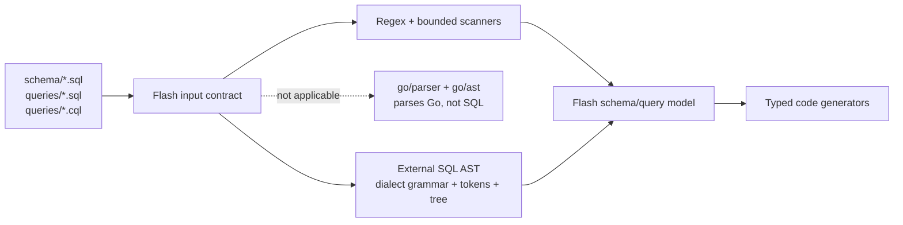
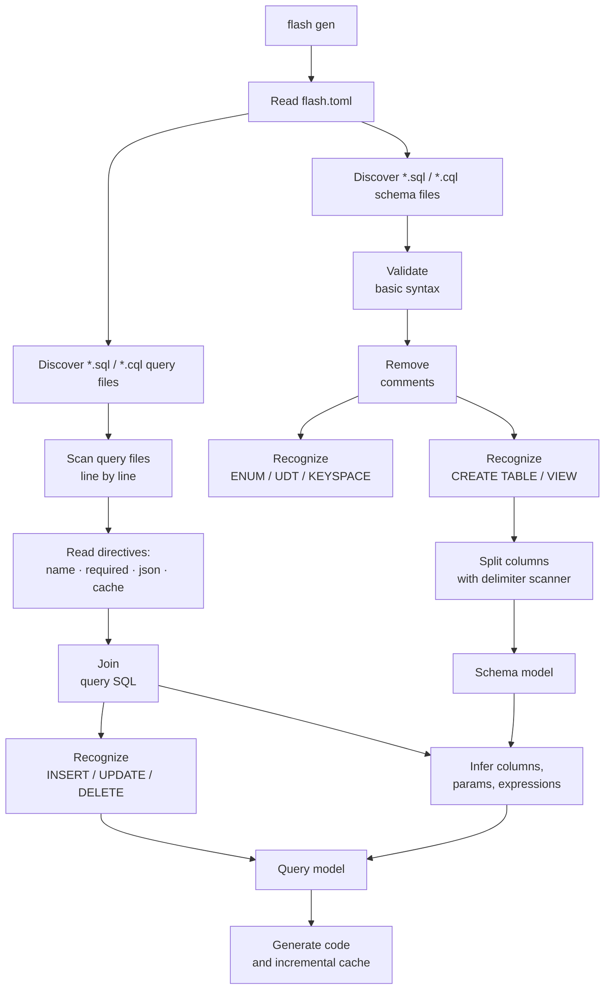
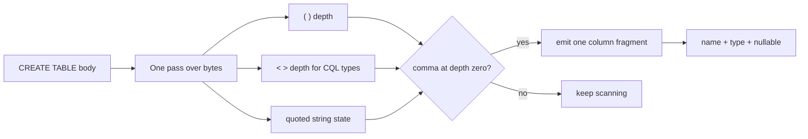
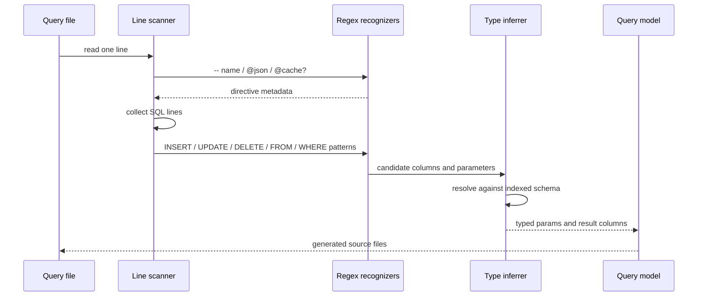
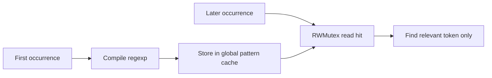
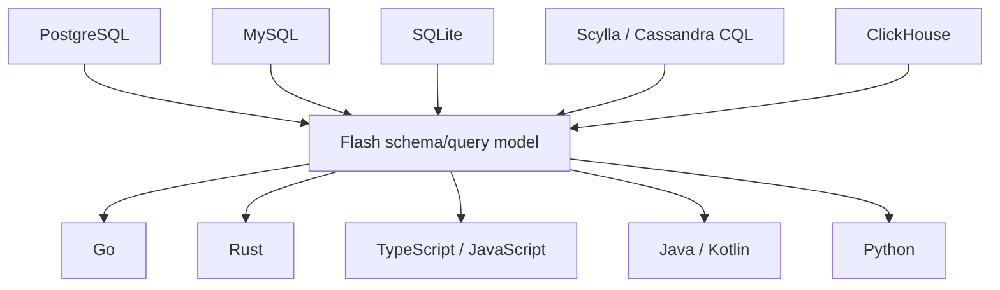
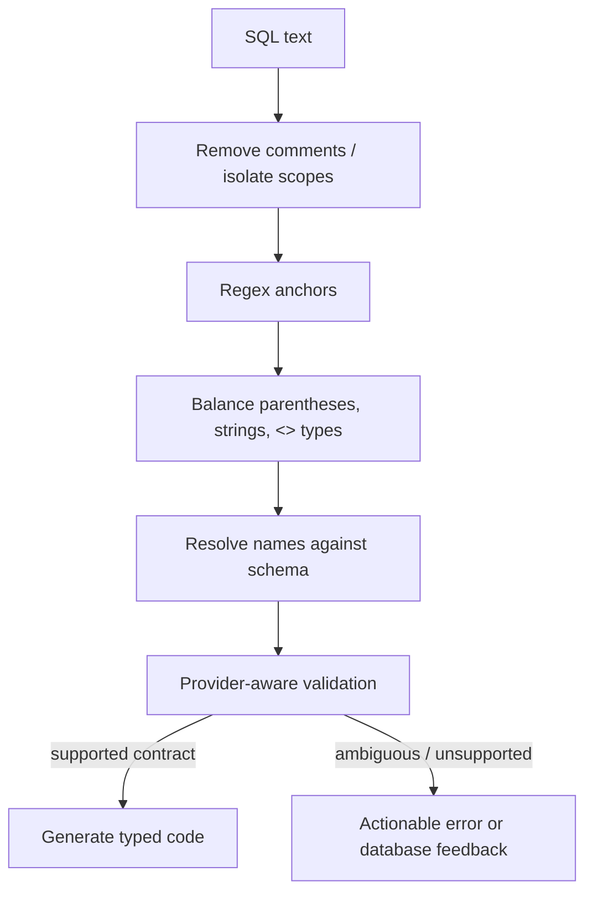
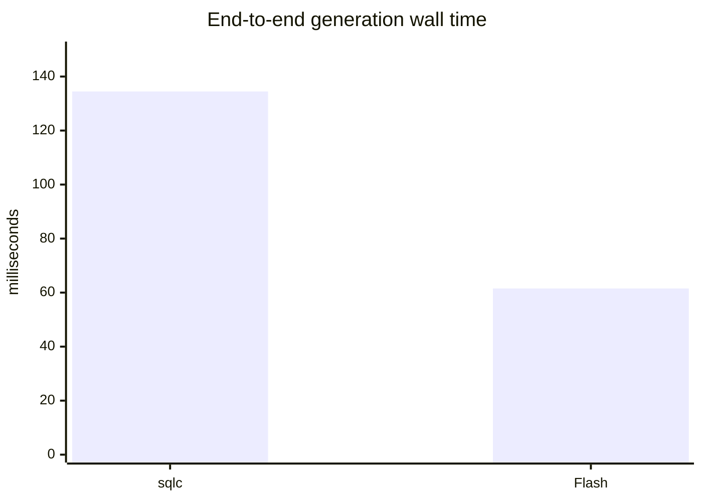
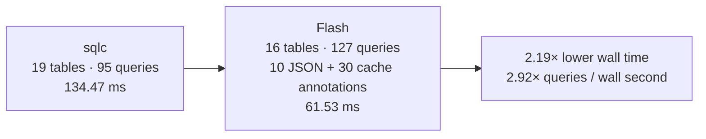

Flash ORM generates type-safe code from schema and query files. It reads SQL or CQL, infers tables, columns, parameters, result types, JSON mappings, caches, and database-specific behavior, then emits Go, Rust, TypeScript, JavaScript, Python, Kotlin, or Java.

The obvious question is: **why does Flash use regular expressions and small scanners instead of parsing every query into a full SQL abstract syntax tree?**

The short answer is that Flash is a code generator with a deliberately focused contract, not a database engine or a SQL formatter. For the syntax Flash needs, precompiled regex plus bounded structural scanning gives a smaller tool, faster startup, fewer dialect dependencies, and direct control over generated semantics. The measured generation numbers in this project support that decision.

This article explains the choice from the actual `tools/goorm` implementation in the Lumos repository.

## First: Which AST Are We Talking About?

There are two different ideas people often mix together:

1. **Go AST** — produced by packages such as `go/parser` and `go/ast`. It parses Go source files.
2. **SQL AST** — produced by a SQL grammar/parser library. It parses `SELECT`, `WITH`, `JOIN`, `INSERT`, CTEs, functions, expressions, and dialect-specific syntax.

Flash reads `.sql` and `.cql` files. A Go AST cannot parse those files at all. To choose an AST design, Flash would need a SQL parser, or several parsers, because its supported targets include PostgreSQL, MySQL, SQLite, Scylla/Cassandra, and ClickHouse.



So the real decision was **Flash's focused recognizer versus an external, dialect-aware SQL AST stack**.

## What Flash Actually Needs to Learn

Flash does not need every detail of SQL semantics. It needs a compact intermediate model:

```go
type Query struct {
    Name       string
    SQL        string
    Cmd        string
    Params     []*Param
    Columns    []*QueryColumn
    JsonTypes  []*JsonType
    CacheDef   *CacheDef
}

type QueryColumn struct {
    Name         string
    Type         string
    Table        string
    Nullable     bool
    IsComputed   bool
    OriginalExpr string
}
```

It also needs schema objects such as `Table`, `Column`, `Enum`, and Cassandra/Scylla `UDT`. It does not need to optimize a query, execute it, prove relational equivalence, or format it back into canonical SQL.

That difference matters. A complete AST answers “what does every token mean in this grammar?” Flash usually needs smaller questions:

- What is the table after `FROM`?
- Which columns are inside `CREATE TABLE (...)`?
- Which `$1` or `?` parameter is associated with which column?
- Is this result expression `COUNT`, `SUM`, `COALESCE`, `ARRAY_AGG`, or a cast?
- What alias follows this expression?
- Which `-- @json` or `-- @cache` directive belongs to this query?

Those are recognition and inference tasks, not full SQL interpretation.

## The End-to-End Regex Pipeline

Flash does not run one enormous regex over an entire project. The pipeline is layered:



The important design is the boundary between regex and scanning. Regex identifies recognizable anchors. Small scanners handle the structures that need positional state: nested parentheses, quoted strings, angle-bracket collection types, and top-level semicolons. Each technique is used where it is strongest.

## Example: Schema Recognition

The schema parser compiles its top-level patterns once:

```go
createTableRegex = regexp.MustCompile(
    `(?i)CREATE\s+TABLE\s+(?:IF\s+NOT\s+EXISTS\s+)?(\S+)\s*\(([\s\S]*?)\);`,
)

enumRegex = regexp.MustCompile(
    `(?i)CREATE\s+TYPE\s+(\w+)\s+AS\s+ENUM\s*\(\s*([^)]+)\s*\)`,
)
```

The table body is not split with `strings.Split(body, ",")`, because commas can occur inside functions or CQL collection types. `SplitColumns` tracks:

- parenthesis depth for `COALESCE(a, b)`;
- angle-bracket depth for `map<text,text>`;
- string-literal state for `'a,b'`;
- commas only at the current top level.



This hybrid is much less code than a complete grammar while still avoiding the common failure mode of splitting a nested expression in half.

## Example: Query Files Have an Explicit Contract

Flash query files are not arbitrary Go strings hidden inside application code. They have explicit directives:

```sql
-- name: FindUsers :many
-- @required: id, email, display_name
SELECT id, email, display_name
FROM users
WHERE team_id = $1
ORDER BY created_at DESC
LIMIT $2;
```

The query parser scans lines with `bufio.Scanner`. It recognizes `-- name:`, `-- @required:`, `-- @json`, and `-- @cache`, then joins the SQL lines and analyzes the resulting query. That explicit format removes a large amount of ambiguity that a general-purpose parser would otherwise need to solve.



The parser also processes files concurrently using a worker pool sized from `runtime.NumCPU()`. Regex objects are safe to reuse across goroutines, and the dynamic pattern cache avoids recompiling the same CTE, aggregate, or column-reference pattern repeatedly.

## Why Regex Is Faster for This Workload

The performance claim can be measured on the real generator. Flash does not need a theoretical promise that every regex path beats every SQL AST library; it needs fast generation for its own schema/query contract. In that workload, fewer parser stages and fewer temporary objects translate directly into shorter runs.

### 1. Linear-time matching in Go's RE2 engine

Go's `regexp` package uses an RE2-style engine. It avoids catastrophic backtracking, so supported patterns have predictable linear-time behavior with respect to input length. That is valuable for build tools that must process many files safely.

### 2. No full token stream or tree allocation

An AST pipeline normally performs:

```text
bytes → lexer tokens → grammar reductions → AST nodes → semantic walk
```

Flash usually performs:

```text
bytes → targeted match → small model field
```

It does not allocate nodes for keywords, punctuation, every expression, every select-list item, or every nested grammar production that the generator will never use.

### 3. One pass where a complete parser would do more work

`SplitColumns`, `findTopLevelSemicolon`, and the parenthesis/string helpers are bounded scans. They preserve just enough structure to keep regex matches scoped correctly. This is cheaper than building a tree for a query whose original SQL must ultimately be preserved and sent to the database unchanged.

### 4. Precompiled and cached patterns

Static patterns are initialized once with `sync.Once`. Dynamic patterns are cached behind an `RWMutex`:

```go
func GetCachedPattern(key string, compile func() *regexp.Regexp) *regexp.Regexp {
    dynPatternCache.mu.RLock()
    pattern, ok := dynPatternCache.patterns[key]
    dynPatternCache.mu.RUnlock()
    if ok {
        return pattern
    }
    // acquire write lock, double-check, compile once, store
}
```

Regex compilation, memory reads, and inference still cost time. The benefit is that Flash compiles static patterns once, caches dynamic patterns, and avoids constructing a complete AST object graph for syntax that the generators do not consume.



## Why the Binary Can Be Smaller

A full SQL AST usually arrives with more than a parser function. It may include a lexer, grammar tables, dialect rules, formatter support, visitor utilities, and dependency code. Even when the final binary impact is modest after Go's linker removes unused code, the dependency graph and compile work are still larger.

Flash's core parser depends on the standard library: `regexp`, `strings`, `bufio`, `os`, `filepath`, and synchronization primitives. Its regex patterns are data embedded in a small amount of code. That tends to produce:

- fewer third-party parser dependencies;
- less compile-time code to type-check and link;
- a smaller conceptual and operational surface;
- easier static distribution as one CLI binary;
- fewer version and dialect-parser upgrades.

The exact binary size should be measured with the same Go version, build flags, and enabled plugins. The architectural reason for a smaller baseline is straightforward: Flash does not ship a general SQL grammar, parse tree, formatter, and visitor framework when its generator only needs a compact schema/query model.

## Multi-Dialect Control Is the Real Reason

Flash supports databases whose syntax and types are not identical:

| Provider | Examples the parser must tolerate |
|---|---|
| PostgreSQL | `$1`, `RETURNING`, JSONB casts, `ILIKE`, arrays |
| MySQL | `?` parameters, backticks, MySQL expressions |
| SQLite | SQLite-specific DDL and placeholders |
| Scylla/Cassandra | CQL collections, keyspaces, UDTs |
| ClickHouse | analytical functions and dialect-specific types |

A single SQL AST library may strongly support one dialect and partially support the others. Multiple AST libraries would fragment the intermediate model and force Flash to reconcile different node shapes. Regex lets Flash keep one generator-oriented model and add a targeted recognizer for a new construct.



The regular expressions are not pretending the dialects are identical. Provider-specific code still exists in validation, type inference, SQL rewriting, database adapters, and generators. Regex is simply the lightweight front end for the common metadata Flash needs.

## Why Not Use a Traditional SQL AST Anyway?

An AST is the right choice when the product needs semantic completeness. A formatter, linter, optimizer, migration planner, IDE language server, or query equivalence checker benefits from a tree that preserves every expression and source position.

Flash has different priorities:

| Requirement | Full SQL AST | Flash recognizer |
|---|---:|---:|
| Cover the generator's required SQL contract | broader than required | purpose-built |
| Startup and generation overhead | higher | low |
| Binary/dependency footprint | higher | lower baseline |
| Add one targeted inference rule | grammar + visitor changes | local regex/helper |
| Preserve original SQL exactly | extra source tracking | natural: original SQL stays intact |
| Generate typed query APIs | possible | direct focus |
| Detect malformed arbitrary SQL | strong | validation plus database/compiler feedback |
| Handle nested delimiters | tree handles it | bounded scanners handle required cases |

The choice is therefore a product boundary: Flash wants enough structure to generate safe APIs, not a complete representation of a language it does not execute.

## Scope Boundaries That Keep Flash Predictable

Flash does not attempt to represent every SQL grammar production. That is a deliberate boundary which keeps the generator quick and portable. When syntax needs positional state, the parser uses scanners; when meaning depends on the database schema, it resolves the match against an indexed schema; when a construct is outside the supported contract, validation reports it instead of silently inventing a type.

Flash keeps that focused contract reliable with several safeguards:

1. It removes comments before schema matching.
2. It tracks quotes and delimiter depth when splitting columns.
3. It strips window `OVER(...)` and subquery blocks before certain validation regexes.
4. It scopes view parsing to top-level semicolons and `FROM` positions.
5. It resolves candidate columns against an indexed schema rather than trusting text alone.
6. It tests edge cases such as CTEs, `BETWEEN`, JSON functions, array parameters, casts, aliases, and `?` versus `$N` placeholders.
7. It leaves the original query SQL available to the database driver instead of rewriting every query into a generated AST string.



This is why “regex” should not be read as “blind string search.” It is a fast recognizer combined with structural helpers, provider-aware validation, and schema context.

## Real Generation Benchmark: sqlc Versus Flash

The following measurements come from the same local generation workflow. They are not synthetic regex microbenchmarks; they are end-to-end code-generation runs.

### sqlc baseline

- 19 tables
- 95 queries
- Wall time: **134.47 ms**
- User CPU time: **68.73 ms**
- System CPU time: **32.08 ms**
- Total CPU time: **100.81 ms**

### Flash run

- 16 tables
- 127 queries
- 10 JSON annotations
- 30 cache annotations
- Wall time: **61.53 ms**
- User CPU time: **77.55 ms**
- System CPU time: **7.07 ms**
- Total CPU time: **84.62 ms**

### What the numbers show

| Measurement | sqlc | Flash | Flash result |
|---|---:|---:|---:|
| Wall time | 134.47 ms | 61.53 ms | **54.2% lower; 2.19× faster** |
| User CPU | 68.73 ms | 77.55 ms | more feature work in Flash's run |
| System CPU | 32.08 ms | 7.07 ms | **77.9% lower** |
| Total CPU | 100.81 ms | 84.62 ms | **16.1% lower** |
| Queries | 95 | 127 | Flash processed 33.7% more queries |
| Queries per wall second | ~706/s | ~2,064/s | about **2.92× higher** |

The comparison is not perfectly controlled because the projects have different table counts, query shapes, and annotation workloads. That makes the result more meaningful in one way: Flash processed more queries and performed 40 extra JSON/cache annotation tasks while still finishing in less than half the wall time.

The CPU profile is also informative. Flash spends slightly more user CPU time doing generator work, but its system time is dramatically lower. That is consistent with a compact in-process pipeline: read the files, match the required constructs, infer types, and emit code without the larger parsing and process overhead visible in the baseline run.





These measurements are why regex is a good choice for Flash's current architecture. It is not selected because a full AST is theoretically impossible; it is selected because the generator's real work completes quickly with a smaller recognition pipeline.

## Performance Should Continue to Be Measured

The expected wins are lower allocations, less parser work, fast cold starts, and a smaller dependency surface. To prove the difference for Flash, benchmark the actual generator with:

- 10, 100, 1,000, and 10,000 query files;
- short queries versus deeply nested CTEs;
- each supported provider;
- cold process startup and warm incremental generation;
- allocations and bytes allocated per run;
- peak resident memory;
- final binary size with identical build flags;
- a representative SQL AST implementation as the baseline.

```bash
go test ./internal/parser -run '^$' -bench . -benchmem
go build -trimpath -ldflags='-s -w' -o flash ./
size flash
```

The conclusion for Flash is evidence-based: its current workload rewards a targeted, mostly linear pipeline. The real run above shows lower wall time, lower total CPU, much lower system CPU, and higher query throughput while also handling Flash-specific annotations. Future benchmarks should keep the same discipline and compare equivalent inputs as the implementation evolves.

## The Decision in One Sentence

Flash chose regex because it needs **fast, portable, generator-oriented recognition across several SQL dialects**, not a complete SQL compiler. Precompiled RE2 patterns handle obvious anchors; bounded scanners handle nesting; schema-aware inference supplies the semantics; and the original SQL remains the source of truth.

If Flash later adds an IDE, SQL formatter, optimizer, or fully semantic refactoring engine, an AST can be added where that new product surface needs it. For the current small, fast, multi-language ORM generator, the regex-plus-scanner architecture is the performance-oriented choice validated by the generator measurements.

## What Could Change in the Future

The choice is not irreversible. A future Flash parser could introduce an AST selectively:

- parse only queries that need deep expression analysis;
- use an AST for a single provider behind the same intermediate model;
- retain regex for directives and file discovery;
- add a tokenizer before replacing targeted recognizers;
- benchmark the migration before increasing binary and compile costs.

That migration path preserves the reason regex was selected in the first place: keep the common generation path quick, predictable, and easy to ship.
